# AgentRails Task Plan

> **Project:** AgentRails — Deterministic AI Workflow Runtime
> **Created:** 2026-04-01
> **Status:** Sprint 6 Complete (Public Release Ready)
> **Methodology:** Priority-based Agile (MoSCoW + story points)
> **Last Updated:** 2026-04-03 — Sprint 6 delivered: CI fixes, session persistence polish, extended integration tests, GitHub issue templates, examples cleanup, LICENSE update, README polish — 224 tests passing (86% coverage), ruff + pylint (10.00/10) + vulture all pass, v0.1.0 tagged

---

## Completed Sprints

### Sprint 1 — Foundation (24 points) ✅

| Task | Status | Notes |
|------|--------|-------|
| `RAIL-001` + `RAIL-002` | ✅ Complete | Package scaffold, pyproject.toml, Makefile |
| `RAIL-003` | ✅ Complete | Logging infrastructure |
| `RAIL-010` | ✅ Complete | WorkflowState with tests |
| `RAIL-022` | ✅ Complete | DAG utilities with tests |
| `RAIL-090` | ✅ Complete | Test infrastructure, fixtures |
| `RAIL-004` | ✅ Complete | CI, .gitignore, CONTRIBUTING |
| `RAIL-102` | ✅ Complete | README |

**Stats:** 53 unit tests passing, package builds successfully

### Sprint 2 — Parser & Steps (22 points) ✅

| Task | Status | Notes |
|------|--------|-------|
| `RAIL-012` | ✅ Complete | OutputParser with JSON/TOML parsing |
| `RAIL-020` | ✅ Complete | YAML DSL parser with full validation |
| `RAIL-021` | ✅ Complete | Jinja2 template engine |
| `RAIL-030` | ✅ Complete | BaseStep ABC with serialize/deserialize |
| `RAIL-031` | ✅ Complete | ShellStep with execution tests |
| `RAIL-006` | ✅ Complete | Config with pyproject.toml support |

**Stats:** 106 unit tests passing (+53 from Sprint 1), parser handles all step types

### Sprint 3 — Session Manager, Agent & Storage (27 points) ✅

| Task | Status | Notes |
|------|--------|-------|
| `RAIL-040` | ✅ Complete | SessionManager with subprocess lifecycle, version check, concurrency |
| `RAIL-032` | ✅ Complete | AgentStep with OutputParser integration, schema validation, serialize/deserialize |
| `RAIL-060` | ✅ Complete | Storage ABC interface |
| `RAIL-061` | ✅ Complete | SQLite backend with events, step results, run listing |
| `RAIL-080` | ✅ Complete | System prompt DSL (defaults + step-level override) |

**Stats:** 152 unit tests passing (+46 from Sprint 2), ruff + pylint (10.00/10) + vulture all pass

**Implementation fixes applied:**
- `storage_sqlite.py`: Fixed `save_state()` to not overwrite `started_at` on updates
- `storage_sqlite.py`: Fixed `load_events()` to parse timestamps back to `datetime`
- `storage_sqlite.py`: Added `workflow_name` parameter support
- `session_manager.py`: Fixed `list_sessions()` to track proper metadata
- `agent_step.py`: Integrated `OutputParser.parse()` for structured output with schema validation
- `agent_step.py`: Added missing `deserialize()` classmethod

**Lint Pipeline Update (2026-04-02):**
- Fixed 25 ruff errors (A001/A002 builtin shadowing, B904 exception chaining, SIM115 context managers, TC001 type-checking imports, B007 unused loop vars, UP037 quoted annotations)
- Fixed pylint to 10.00/10 score (removed unnecessary pass statements, fixed import-outside-toplevel, f-string logging, unused variables, shadowed names, no-else-raise)
- Fixed vulture warnings by prefixing unused stub parameters with `_`
- Removed `ty` type checker from pipeline — 2 unresolved issues: (1) `asyncio.gather` tuple unpacking after isinstance guard, (2) `asyncpg` optional dependency unresolved import. Will re-add when ty matures.
- CLI parameter naming fixed — Click argument names now match function parameter names with `# noqa: F841` for unused stub params

---

### Sprint 4 — Engine, CLI & Walking Skeleton (19 points) ✅

| Task | Status | Notes |
|------|--------|-------|
| `RAIL-050` | ✅ Complete | WorkflowRunner with DAG walking, event sourcing, SQLite checkpointing, resume() |
| `RAIL-070` | ✅ Complete | 8 CLI commands: run, resume, status, list, validate, visualize, logs, export |
| `RAIL-071` | ✅ Complete | Compact progress display with JSON summary line |
| `RAIL-005` | ✅ Complete | Walking skeleton integration test passes end-to-end |

**Stats:** 168 tests passing (+16 from Sprint 3), ruff + pylint (10.00/10) + vulture all pass

**Key Features Delivered:**
- `agentrails run workflow.yaml` — executes workflows with compact progress output
- `agentrails validate workflow.yaml` — validates YAML (detects cycles, missing deps)
- `agentrails visualize workflow.yaml` — Mermaid and ASCII DAG visualization
- `agentrails list` — shows all workflow runs with status
- `agentrails status <run_id>` — shows run status + step results
- `agentrails logs <run_id>` — shows event log
- `agentrails export <run_id>` — exports final state as JSON
- `agentrails resume <run_id>` — resumes workflow from checkpoint

**Implementation Notes:**
- Sequential step execution (parallel DAG branches execute one at a time; concurrency deferred to Sprint 5)
- Fail-fast error handling (no retries; RAIL-052 deferred to Sprint 6)
- Event sourcing with SQLite storage for deterministic replay
- WorkflowState immutability fixed — engine now correctly chains `state = state.set(key, value)`
- Run status properly updated to `completed`/`failed` with `completed_at` timestamp

---

### Sprint 5 — P1 Features & Event Log (21 points) ✅

| Task | Status | Notes |
|------|--------|-------|
| `RAIL-042` | ✅ Complete | Claude CLI version detection: semver parsing, minimum version check, graceful degradation, `has_flag()` method |
| `RAIL-011` | ✅ Complete | State schema validation: `WorkflowState.validate()`, engine validation hook after each step |
| `RAIL-034` | ✅ Complete | ConditionalStep: `deserialize()`, engine routing for then/else branches, skipped step tracking |
| `RAIL-033` | ✅ Complete | ParallelGroupStep: `deserialize()`, comprehensive concurrent execution tests |
| `RAIL-051` | ✅ Complete | Event Log & Replay: fixed immutable state bug, skipped steps tracking, schema drift detection with workflow hashing |

**Stats:** 199 tests passing (+31 from Sprint 4), ruff + pylint (10.00/10) + vulture all pass

**Key Features Delivered:**
- **Engine refactor:** Extracted shared `_execute_steps()` method, eliminating ~300 lines of duplication between `run()` and `resume()`
- **Claude CLI version detection:** Semver regex parsing, minimum version enforcement, feature detection via `has_flag()`, clear error messages for missing/too-old CLI
- **State schema validation:** `WorkflowState.validate()` using jsonschema, automatic validation after each step completes, validation errors fail workflow with clear messages
- **ConditionalStep branching:** ConditionalStep evaluates `if` condition, engine marks non-selected `then`/`else` steps as skipped, supports optional `else` clause
- **ParallelGroupStep:** Full serialize/deserialize roundtrip, concurrent branch execution with semaphore limiting, fail_fast cancellation, merge strategies (overwrite, list_append, fail_on_conflict)
- **Event Log improvements:** Fixed replay() immutable state bug (`state = state.set()`), tracks skipped steps, schema drift detection via workflow YAML hashing

**Implementation Notes:**
- Engine refactor makes future modifications safer — single execution loop instead of duplicated logic
- Version detection stores both raw version string and parsed tuple for comparison
- Schema drift detection hashes workflow YAML at `workflow_started`, warns on resume if YAML changed
- ConditionalStep uses `if` field (not `condition` which is for generic step skipping)
- ParallelGroupStep lazy-imports dsl_parser to avoid circular import (suppressed with `# pylint: disable=cyclic-import`)

---

## Priority Legend

| Priority | Label | Meaning |
|----------|-------|---------|
| P0 | **Must Have** | MVP blocker — nothing ships without this |
| P1 | **Should Have** | Expected for a usable MVP, but not a hard blocker |
| P2 | **Could Have** | Enhances MVP, can slip to next cycle |
| P3 | **Won't Have (yet)** | Documented for future; do not build now |

## Story Point Scale

| Points | Complexity |
|--------|------------|
| 1 | Trivial — config, renaming, small helpers |
| 2 | Small — single-file, well-understood change |
| 3 | Medium — multi-file, some design decisions |
| 5 | Large — cross-cutting, needs integration testing |
| 8 | Very Large — architectural, multiple subsystems |
| 13 | Epic-level — break down further before starting |

---

## Full Project Directory Structure

> This is the canonical layout. All tasks reference paths relative to this tree.

```
agentrails/                          # Repository root
├── .github/
│   └── workflows/
│       └── ci.yml                   # GitHub Actions CI pipeline
├── .gitignore                       # Python, tooling, IDE, .agentrails/ exclusions
├── CLAUDE.md                        # AI agent project guide
├── CONTRIBUTING.md                  # Code style, PR process, dev setup
├── LICENSE
├── Makefile                         # Build, test, lint, format commands
├── README.md
├── TASKPLAN.md                      # This file
├── deep-research-report.md          # Original research doc
├── pyproject.toml                   # PEP 621 project config, pinned deps, tool config
│
├── agentrails/                      # Python package root
│   ├── __init__.py                  # Package root, exports __version__
│   ├── py.typed                     # PEP 561 type-checking marker (empty file)
│   ├── cli.py                       # Click CLI entry point
│   ├── config.py                    # Unified configuration management
│   ├── dag.py                       # DAG data structure and algorithms
│   ├── display.py                   # Output manager (compact + interactive modes)
│   ├── dsl_parser.py                # YAML -> Workflow parser
│   ├── engine.py                    # WorkflowRunner execution engine
│   ├── event_log.py                 # Event sourcing / replay
│   ├── output.py                    # Structured output parsing (JSON/TOML)
│   ├── session_manager.py           # Claude CLI subprocess manager
│   ├── state.py                     # WorkflowState + MergeStrategy
│   ├── storage.py                   # StateStore ABC
│   ├── storage_sqlite.py            # SQLite backend
│   ├── storage_postgres.py          # PostgreSQL backend (P2)
│   ├── template.py                  # Jinja2-based template engine
│   ├── utils.py                     # Logging config, helpers
│   └── steps/                       # Step type implementations
│       ├── __init__.py              # Re-exports all step types
│       ├── base.py                  # BaseStep ABC, StepResult, ExecutionContext
│       ├── agent_step.py            # AgentStep — Claude CLI invocation
│       ├── shell_step.py            # ShellStep — subprocess execution
│       ├── parallel_step.py         # ParallelGroupStep — concurrent branches
│       ├── conditional_step.py      # ConditionalStep — if/then/else
│       ├── loop_step.py             # LoopStep — repeat until condition
│       └── human_step.py            # HumanStep — wait for human input
│
├── tests/                           # All tests (pytest root)
│   ├── conftest.py                  # Shared fixtures, pytest config
│   ├── __init__.py
│   ├── test_state.py                # WorkflowState unit tests
│   ├── test_dag.py                  # DAG unit tests
│   ├── test_output.py               # OutputParser unit tests
│   ├── test_template.py             # Template engine unit tests
│   ├── test_dsl_parser.py           # YAML parser unit tests
│   ├── test_engine.py               # WorkflowRunner unit tests
│   ├── test_event_log.py            # Event log unit tests
│   ├── test_storage_sqlite.py       # SQLite backend unit tests
│   ├── test_storage.py              # Storage interface unit tests
│   ├── test_session_manager.py      # SessionManager unit tests
│   ├── test_steps/                  # Step-type-specific tests
│   │   ├── __init__.py
│   │   ├── test_shell_step.py
│   │   ├── test_agent_step.py
│   │   ├── test_parallel_step.py
│   │   ├── test_conditional_step.py
│   │   ├── test_loop_step.py
│   │   └── test_human_step.py
│   ├── test_cli.py                  # CLI integration tests
│   ├── integration/                 # End-to-end integration tests
│   │   ├── __init__.py
│   │   ├── test_smoke.py            # Walking skeleton end-to-end test
│   │   ├── test_linear_workflow.py
│   │   ├── test_parallel_workflow.py
│   │   ├── test_conditional_workflow.py
│   │   ├── test_replay.py
│   │   └── mock_claude_cli.py       # Fake claude binary for testing
│   └── fixtures/                    # Sample YAML workflows for tests
│       ├── linear.yaml
│       ├── parallel.yaml
│       ├── conditional.yaml
│       ├── loop.yaml
│       ├── smoke.yaml               # Walking skeleton: single shell step
│       ├── cyclic.yaml              # Invalid — for cycle detection test
│       ├── bad_dep.yaml             # Invalid — for missing dep test
│       └── prompts/
│           └── architect.md         # Sample system prompt file
│
├── examples/                        # Example workflows for users
│   ├── simple_linear.yaml
│   ├── parallel_tests.yaml
│   ├── retry_loop.yaml
│   └── prompts/
│       ├── architect.md
│       └── code_only.md
│
└── migrations/                      # PostgreSQL migrations (P2)
    └── 001_initial.sql
```

---

## Epic 1: Project Scaffolding & Core Infrastructure

> **Goal:** Establish the Python package structure, dev tooling, CI, and base abstractions that all other epics depend on.

### 1.1 — Package Structure Setup

| Field | Value |
|-------|-------|
| **ID** | `RAIL-001` |
| **Priority** | P0 |
| **Points** | 3 |
| **Depends On** | — |
| **Assignable** | Yes |

**Description:**
Create the Python package layout matching the directory structure above. This is the skeleton every other task builds on.

**Acceptance Criteria:**
- [ ] All directories and `__init__.py` files from the directory structure above exist
- [ ] All `.py` source files in `agentrails/` exist as stubs (module docstring + placeholder class/function)
- [ ] `agentrails/__init__.py` exports `__version__ = "0.1.0"`
- [ ] `agentrails/py.typed` exists (empty file, PEP 561 marker)
- [ ] `tests/conftest.py` exists with a docstring
- [ ] `tests/fixtures/` directory with placeholder YAML files
- [ ] All stubs import cleanly: `python -c "import agentrails"` succeeds
- [ ] `pyproject.toml` created per `RAIL-002` spec (see below)
- [ ] `Makefile` created per `RAIL-002` spec (see below)

**Implementation Notes:**
- Use flat layout (not `src/`): package dir `agentrails/` sits at repo root
- Every stub file should have a module-level docstring explaining its purpose
- Stub classes should use `pass` or `raise NotImplementedError`

---

### 1.2 — Dev Tooling, Linting & Build

| Field | Value |
|-------|-------|
| **ID** | `RAIL-002` |
| **Priority** | P0 |
| **Points** | 3 |
| **Depends On** | `RAIL-001` |
| **Assignable** | Yes |

**Description:**
Configure `pyproject.toml` with pinned dependency versions, all tool configuration (ruff, ty, pylint, vulture, pytest), uv as package manager, and a `Makefile` with test/lint/build targets.

**Acceptance Criteria:**

#### pyproject.toml

- [ ] Full `pyproject.toml` created with the following content (pinned versions):

```toml
[build-system]
requires = ["hatchling"]
build-backend = "hatchling.build"

[project]
name = "agentrails"
version = "0.1.0"
description = "Deterministic AI workflow runtime for orchestrating Claude Code and CLI tools"
readme = "README.md"
license = { text = "Apache-2.0" }
requires-python = ">=3.11"
authors = [
    { name = "AgentRails Contributors" },
]
classifiers = [
    "Development Status :: 3 - Alpha",
    "Intended Audience :: Developers",
    "License :: OSI Approved :: Apache Software License",
    "Programming Language :: Python :: 3",
    "Programming Language :: Python :: 3.11",
    "Programming Language :: Python :: 3.12",
    "Programming Language :: Python :: 3.13",
    "Topic :: Software Development :: Libraries :: Application Frameworks",
]

dependencies = [
    "click==8.3.1",
    "jinja2==3.1.6",
    "jsonschema==4.26.0",
    "pyyaml==6.0.3",
    "aiosqlite==0.22.1",
]

[project.optional-dependencies]
interactive = [
    "rich==14.3.3",
    "textual==3.1.0",
]
postgres = [
    "asyncpg==0.31.0",
]
dev = [
    "pytest==9.0.2",
    "pytest-asyncio==1.3.0",
    "pytest-cov==7.1.0",
    "ruff==0.15.8",
    "pylint==4.0.5",
    "vulture==2.16",
    "rich==14.3.3",
    "textual==3.1.0",
]

[project.scripts]
agentrails = "agentrails.cli:main"

[tool.pytest.ini_options]
testpaths = ["tests"]
asyncio_mode = "auto"
asyncio_default_fixture_loop_scope = "function"
markers = [
    "integration: marks tests as integration tests (deselect with '-m \"not integration\"')",
]

[tool.ruff]
target-version = "py311"
line-length = 100

[tool.ruff.lint]
select = ["E", "F", "W", "I", "N", "UP", "B", "A", "SIM", "TCH"]
ignore = ["E501"]

[tool.ruff.format]
quote-style = "double"
indent-style = "space"
line-ending = "auto"

[tool.pylint.main]
load-plugins = []
jobs = 0

[tool.pylint."messages control"]
disable = [
    "C0114",  # missing-module-docstring (handled by ruff)
    "C0115",  # missing-class-docstring
    "C0116",  # missing-function-docstring
    "R0903",  # too-few-public-methods
]

[tool.pylint.format]
max-line-length = 100

[tool.vulture]
min_confidence = 80
paths = ["agentrails/"]

[tool.hatch.build.targets.wheel]
packages = ["agentrails"]
```

**Note:** `uv` is used as the package manager and build tool instead of pip. The `ty` type checker was removed from the pipeline in Sprint 6 (2026-04-03) due to unresolved issues with optional imports and asyncio.gather return types. ruff + pylint provide comprehensive linting coverage.

#### Makefile

- [ ] `Makefile` created at repository root with the following targets:

```makefile
.PHONY: install install-dev lint format test test-all test-cov build clean

# Install the package in the current environment
install:
	uv pip install .

# Install with all dev dependencies (editable)
install-dev:
	uv pip install -e ".[dev]"

# Run all linters: ruff, pylint, vulture
lint:
	uv run ruff check agentrails/ tests/
	uv run pylint agentrails/
	uv run vulture agentrails/

# Auto-format code with ruff
format:
	uv run ruff format agentrails/ tests/
	uv run ruff check --fix agentrails/ tests/

# Run tests (unit only, excludes integration)
test:
	uv run pytest -m "not integration"

# Run all tests including integration
test-all:
	uv run pytest

# Run tests with coverage report
test-cov:
	uv run pytest --cov=agentrails --cov-report=term-missing --cov-report=html

# Build distributable package (wheel + sdist)
build:
	uv build

# Clean build artifacts
clean:
	rm -rf dist/ build/ *.egg-info .pytest_cache .coverage htmlcov/
	find . -type d -name __pycache__ -exec rm -rf {} + 2>/dev/null || true
```

#### Build & Install Workflow

- [ ] `make build` produces a wheel (`.whl`) and source dist (`.tar.gz`) in `dist/`
- [ ] The built wheel is installable via `uv pip install dist/agentrails-0.1.0-py3-none-any.whl`
- [ ] After install, `agentrails --help` works (invokes `agentrails.cli:main`)
- [ ] `make install` installs directly from source
- [ ] `make install-dev` installs in editable mode with all dev deps
- [ ] All lint/test targets pass on the empty scaffold

**Build & Install Guide (for local machine):**

Requires `uv` (Astral's Python package manager). Install with: `curl -LsSf https://astral.sh/uv/install.sh | sh`

There are three ways to install AgentRails locally:

1. **Development mode** (recommended while developing):
   ```bash
   uv venv                   # create a virtual environment
   source .venv/bin/activate
   make install-dev          # uv pip install -e ".[dev]"
   agentrails --help         # CLI is now available
   ```
   Editable install — changes to source code take effect immediately.

2. **Build and install a wheel** (for distributing or clean installs):
   ```bash
   make build                # produces dist/agentrails-0.1.0-py3-none-any.whl
   uv pip install dist/agentrails-0.1.0-py3-none-any.whl
   agentrails --help
   ```

3. **Direct install from source** (quick, non-editable):
   ```bash
   make install              # uv pip install .
   agentrails --help
   ```

**To uninstall:**
```bash
uv pip uninstall agentrails
```

---

### 1.3 — Logging Infrastructure

| Field | Value |
|-------|-------|
| **ID** | `RAIL-003` |
| **Priority** | P0 |
| **Points** | 2 |
| **Depends On** | `RAIL-001` |
| **Assignable** | Yes |

**Description:**
Set up structured logging that every module uses. Logs are critical for debugging workflows and for the observability features later.

**Acceptance Criteria:**
- [ ] `agentrails/utils.py` provides `get_logger(name: str) -> logging.Logger`
- [ ] Default format is JSON (structured) with fields: `timestamp`, `level`, `module`, `step_id` (optional), `workflow_id` (optional), `message`
- [ ] Log level configurable via env var `AGENTRAILS_LOG_LEVEL` (default: `INFO`)
- [ ] Optional human-readable format when `AGENTRAILS_LOG_FORMAT=text`
- [ ] All modules use this logger, not `print()` or bare `logging`

---

### 1.4 — Project Hygiene (CI, .gitignore, CONTRIBUTING)

| Field | Value |
|-------|-------|
| **ID** | `RAIL-004` |
| **Priority** | P0 |
| **Points** | 3 |
| **Depends On** | `RAIL-001`, `RAIL-002` |
| **Assignable** | Yes |

**Description:**
Set up the project hygiene essentials that should exist from day one: `.gitignore`, CI pipeline, and contribution guidelines. These are currently just checkboxes on RAIL-110 but are needed immediately — not at release time.

**Acceptance Criteria:**
- [ ] `.gitignore` created with entries for:
  - Python: `__pycache__/`, `*.pyc`, `*.pyo`, `*.egg-info/`, `dist/`, `build/`, `.eggs/`
  - Env: `.env`, `.env.local`, `.env.*.local`
  - Tooling: `.venv/`, `.pytest_cache/`, `.coverage`, `htmlcov/`, `.ruff_cache/`
  - AgentRails: `.agentrails/` (runtime state directory)
  - IDE: `.vscode/`, `.idea/`, `*.swp`, `*.swo`
- [ ] GitHub Actions CI workflow (`.github/workflows/ci.yml`):
  - Triggers on push to `main` and on pull requests
  - Matrix: Python 3.11, 3.12, 3.13
  - Steps: checkout, install `uv`, `make install-dev`, `make lint`, `make test-cov`
  - Upload coverage report as artifact
- [ ] `CONTRIBUTING.md` created with:
  - Development setup instructions (reference Makefile targets)
  - Code style: ruff config, 100 char line length, double quotes
  - Commit message format: `RAIL-XXX: description`
  - PR process: branch from `main`, require CI pass, one approval
  - How to add a new step type (reference `BaseStep` ABC)
  - How to run tests: `make test`, `make test-cov`
- [ ] Branch protection configured on `main` (documented in CONTRIBUTING.md, applied manually)

**Implementation Notes:**
- CI should use `uv` for fast installs (cache the uv binary and `.venv`)
- Keep the CI workflow simple — one job with sequential steps, not a complex matrix
- `.gitignore` should be created in RAIL-001 as part of the scaffold, but this task verifies and extends it

---

### 1.5 — Walking Skeleton (End-to-End Smoke Test)

| Field | Value |
|-------|-------|
| **ID** | `RAIL-005` |
| **Priority** | P0 |
| **Points** | 3 |
| **Depends On** | `RAIL-020`, `RAIL-031`, `RAIL-061`, `RAIL-050` |
| **Assignable** | Yes |

**Description:**
Create a minimal end-to-end test that proves the entire pipeline works: parse a YAML workflow, execute a single shell step, checkpoint state to SQLite, and complete. This is the "it actually runs" milestone — if this doesn't work, nothing else matters.

**Acceptance Criteria:**
- [ ] A fixture workflow `tests/fixtures/smoke.yaml` with a single shell step:
  ```yaml
  name: smoke_test
  steps:
    - id: hello
      type: shell
      script: "echo hello"
      output_format: text
  ```
- [ ] Integration test `tests/integration/test_smoke.py` that:
  1. Calls `WorkflowRunner.run("tests/fixtures/smoke.yaml")`
  2. Asserts `result.status == "completed"`
  3. Asserts `result.step_results["hello"].outputs["stdout"] == "hello\n"`
  4. Asserts a SQLite state file was created
  5. Asserts the event log contains `workflow_started`, `step_started`, `step_completed`, `workflow_completed`
- [ ] CLI test: `agentrails run tests/fixtures/smoke.yaml` exits with code 0 and prints compact progress output
- [ ] This test runs in CI and must pass before any Sprint 4+ work begins
- [ ] Test runs in < 5 seconds (no Claude CLI, just a shell step)

**Implementation Notes:**
- This is NOT a new component — it wires together existing components built in Sprints 1-3
- If this test fails, it means integration between parser, engine, steps, and storage is broken
- This is the team's confidence gate: "the system actually works end-to-end"

---

### 1.6 — Unified Configuration Management

| Field | Value |
|-------|-------|
| **ID** | `RAIL-006` |
| **Priority** | P1 |
| **Points** | 3 |
| **Depends On** | `RAIL-001`, `RAIL-003` |
| **Assignable** | Yes |

**Description:**
Define a single configuration resolution strategy so all modules resolve settings consistently. Without this, each module will invent its own approach to reading env vars, CLI flags, and config files.

**Acceptance Criteria:**
- [ ] `agentrails/config.py` contains a `Config` dataclass with all configurable settings:
  ```python
  @dataclass
  class Config:
      log_level: str = "INFO"              # AGENTRAILS_LOG_LEVEL
      log_format: str = "json"             # AGENTRAILS_LOG_FORMAT
      storage_backend: str = "sqlite"      # AGENTRAILS_STORAGE
      db_url: str | None = None            # AGENTRAILS_DB_URL
      state_dir: str = ".agentrails"       # AGENTRAILS_STATE_DIR
      max_concurrent_sessions: int = 5     # AGENTRAILS_MAX_SESSIONS
      default_permission_mode: str = "bypassPermissions"
      claude_cli_path: str = "claude"      # AGENTRAILS_CLAUDE_PATH
  ```
- [ ] Resolution order (highest priority wins):
  1. CLI flags (passed via Click context)
  2. Environment variables (`AGENTRAILS_*` prefix)
  3. `pyproject.toml` `[tool.agentrails]` section (optional)
  4. Hardcoded defaults
- [ ] `Config.from_env() -> Config` class method loads from environment
- [ ] `Config.from_cli(**kwargs) -> Config` merges CLI overrides
- [ ] All modules access config through a shared instance, not by reading env vars directly
- [ ] Config is frozen after initialization (no mutation during workflow execution)

**Implementation Notes:**
- Do NOT use a third-party config library — the resolution logic is simple enough for a single module
- The `pyproject.toml` source is optional and uses `tomllib` (stdlib in 3.11+)
- This task should be completed early so all subsequent modules can depend on it

---

### 1.7 — Claude CLI Version Detection

| Field | Value |
|-------|-------|
| **ID** | `RAIL-042` |
| **Priority** | P1 |
| **Points** | 2 |
| **Depends On** | `RAIL-040` |
| **Assignable** | Yes |

**Description:**
The task plan assumes specific Claude CLI flags exist (`--bare`, `--permission-mode`, `--json-schema`, `--allowedTools`). If the user has an older Claude CLI version, these flags may not exist and execution will fail with confusing errors. Add version detection and graceful degradation.

**Acceptance Criteria:**
- [ ] `SessionManager` calls `claude --version` on initialization and parses the version string
- [ ] Minimum supported version is documented (the version that supports `--bare` and `--permission-mode`)
- [ ] If Claude CLI is not found on `$PATH`, raise a clear error:
  ```
  Error: Claude CLI not found. Install it from https://claude.ai/download
  ```
- [ ] If Claude CLI version is below minimum, raise a clear error:
  ```
  Error: Claude CLI version X.Y.Z is too old. AgentRails requires >= A.B.C.
  Upgrade: npm install -g @anthropic-ai/claude-cli
  ```
- [ ] If specific flags are unavailable in the detected version, log warnings and degrade gracefully:
  - Missing `--bare`: log warning, continue without it (non-deterministic but functional)
  - Missing `--permission-mode`: fall back to `--allowedTools` with a broad list, or fail with instructions
  - Missing `--json-schema`: skip native schema validation, fall back to `OutputParser` post-processing
- [ ] Version info is included in `SessionResult` metadata for debugging
- [ ] Version check is performed once per `SessionManager` lifetime, not per session

**Implementation Notes:**
- `claude --version` output format may vary — use a regex to extract semver
- Cache the version check result on the `SessionManager` instance
- This is a defensive measure — most users will have a recent version, but the error messages save significant debugging time

---

## Epic 2: Workflow State & Schema System

> **Goal:** Implement the typed state object that steps read from and write to, including schema validation and structured output serialization.

### 2.1 — WorkflowState Core

| Field | Value |
|-------|-------|
| **ID** | `RAIL-010` |
| **Priority** | P0 |
| **Points** | 5 |
| **Depends On** | `RAIL-001` |
| **Assignable** | Yes |

**Description:**
Implement the `WorkflowState` class — the central data structure that accumulates step outputs and is passed between steps.

**Acceptance Criteria:**
- [ ] `agentrails/state.py` contains `WorkflowState` class
- [ ] State is a nested dict-like object supporting dot-path access: `state.get("tests.unit.status")` and `state.set("tests.unit.status", "pass")`
- [ ] State supports JSON serialization and deserialization (for checkpointing and storage)
- [ ] State is immutable-by-default with explicit `.update(key, value) -> WorkflowState` returning a new copy (for deterministic replay)
- [ ] `state.snapshot() -> dict` returns a deep copy of the entire state
- [ ] `state.merge(other: WorkflowState, strategy: MergeStrategy)` merges two states (for parallel branches)
- [ ] `MergeStrategy` enum: `OVERWRITE`, `LIST_APPEND`, `FAIL_ON_CONFLICT`

**Test Cases:**
```python
def test_dot_path_access():
    state = WorkflowState({"tests": {"unit": {"status": "pass"}}})
    assert state.get("tests.unit.status") == "pass"

def test_immutable_update():
    s1 = WorkflowState({})
    s2 = s1.update("plan", "do things")
    assert s1.get("plan") is None
    assert s2.get("plan") == "do things"

def test_json_roundtrip():
    s = WorkflowState({"key": "value", "nested": {"a": 1}})
    assert WorkflowState.from_json(s.to_json()) == s
```

**Implementation Notes:**
- **TOML serialization is intentionally excluded from WorkflowState.** TOML's limited type system (no null, no mixed-type arrays, awkward nested tables) makes it a poor fit for arbitrary runtime state. JSON is used for all state persistence. TOML output parsing remains available in RAIL-012 (OutputParser) for steps that produce TOML output.
- `tomli-w` has been removed from core dependencies since state no longer needs TOML writing. TOML reading for output parsing uses `tomllib` (stdlib in Python 3.11+).

---

### 2.2 — State Schema Validation

| Field | Value |
|-------|-------|
| **ID** | `RAIL-011` |
| **Priority** | P1 |
| **Points** | 3 |
| **Depends On** | `RAIL-010` |
| **Assignable** | Yes |

**Description:**
Allow workflows to define a JSON Schema for their state, and validate state after each step completes.

**Acceptance Criteria:**
- [ ] YAML workflow definition supports a top-level `state` block with JSON Schema syntax:
  ```yaml
  state:
    type: object
    properties:
      plan: { type: string }
      code: { type: string }
      success: { type: boolean }
    required: [plan]
  ```
- [ ] After each step writes its outputs, validate the full state against the schema
- [ ] Validation errors include: which field failed, expected type, actual value
- [ ] If no `state` block is defined, skip validation (permissive mode)
- [ ] Use `jsonschema` library for validation

---

### 2.3 — Structured Output Handling (JSON/TOML)

| Field | Value |
|-------|-------|
| **ID** | `RAIL-012` |
| **Priority** | P0 |
| **Points** | 5 |
| **Depends On** | `RAIL-010` |
| **Assignable** | Yes |

**Description:**
Steps (especially agent steps) must produce structured output, not just raw text. This task implements parsing, validation, and format conversion of step outputs into JSON or TOML.

**Acceptance Criteria:**
- [ ] `agentrails/output.py` contains `OutputParser` class
- [ ] Each step in YAML can declare its expected output format:
  ```yaml
  - id: plan
    type: agent
    prompt: "Generate a plan"
    output_format: json          # or "toml" or "text"
    output_schema:               # optional JSON Schema for the output
      type: object
      properties:
        title: { type: string }
        steps: { type: array, items: { type: string } }
      required: [title, steps]
  ```
- [ ] `OutputParser.parse(raw_text: str, format: str, schema: dict | None) -> dict | str`
  - For `json`: extract JSON from agent response (handle markdown code fences), parse, validate against schema if provided
  - For `toml`: extract TOML from agent response, parse, validate
  - For `text`: return raw string
- [ ] If agent output contains multiple JSON blocks, extract the last one (most likely the final answer)
- [ ] On parse failure, raise `OutputParseError` with the raw text and expected format so the engine can retry or fail gracefully
- [ ] Include robust extraction that handles:
  - JSON/TOML wrapped in ` ```json ... ``` ` code fences
  - Leading/trailing prose around the structured block
  - Escaped characters within the block

**Test Cases:**
```python
def test_parse_json_from_fenced_block():
    raw = 'Here is the plan:\n```json\n{"title": "Plan A", "steps": ["a", "b"]}\n```\nDone.'
    result = OutputParser.parse(raw, "json", schema=None)
    assert result == {"title": "Plan A", "steps": ["a", "b"]}

def test_parse_toml_from_fenced_block():
    raw = '```toml\ntitle = "Plan A"\nsteps = ["a", "b"]\n```'
    result = OutputParser.parse(raw, "toml", schema=None)
    assert result == {"title": "Plan A", "steps": ["a", "b"]}

def test_schema_validation_failure():
    raw = '{"title": "Plan A"}'  # missing required "steps"
    with pytest.raises(OutputParseError):
        OutputParser.parse(raw, "json", schema={"required": ["title", "steps"], ...})
```

---

## Epic 3: YAML DSL Parser

> **Goal:** Parse workflow YAML files into an in-memory DAG of step objects, with full validation.

### 3.1 — YAML Parser Core

| Field | Value |
|-------|-------|
| **ID** | `RAIL-020` |
| **Priority** | P0 |
| **Points** | 5 |
| **Depends On** | `RAIL-001`, `RAIL-010`, `RAIL-022` |
| **Assignable** | Yes |

**Description:**
Implement `parse_workflow(yaml_path: str) -> Workflow` that reads a YAML file and returns a validated in-memory workflow object.

**Acceptance Criteria:**
- [ ] `agentrails/dsl_parser.py` contains `parse_workflow()` function
- [ ] Returns a `Workflow` dataclass containing:
  ```python
  @dataclass
  class Workflow:
      name: str
      steps: list[BaseStep]        # ordered by dependency
      state_schema: dict | None    # optional JSON Schema
      dag: DAG                     # adjacency list representation
      defaults: WorkflowDefaults   # default settings for steps
  ```
- [ ] Each step in YAML is converted to the appropriate `BaseStep` subclass based on `type` field
- [ ] Supported step types: `agent`, `shell`, `parallel_group`, `conditional`, `loop`, `human`
- [ ] `depends_on` fields are resolved into DAG edges
- [ ] Template expressions (`{{state.plan}}`) are preserved as strings for later rendering (not evaluated at parse time)

**Validation Rules (fail fast at parse time):**
- [ ] All `id` values are unique within the workflow
- [ ] All `depends_on` references point to existing step IDs
- [ ] No cycles in the DAG (topological sort must succeed)
- [ ] Required fields per step type are present (e.g., `agent` requires `prompt`, `shell` requires `script`)
- [ ] `output_format` if specified must be one of: `json`, `toml`, `text`
- [ ] Clear error messages: `"Step 'deploy' depends on 'build', which does not exist"`

**Test Cases:**
```python
def test_parse_linear_workflow():
    wf = parse_workflow("tests/fixtures/linear.yaml")
    assert len(wf.steps) == 3
    assert wf.dag.topological_order() == ["step1", "step2", "step3"]

def test_cycle_detection():
    with pytest.raises(ValidationError, match="cycle"):
        parse_workflow("tests/fixtures/cyclic.yaml")

def test_missing_dependency():
    with pytest.raises(ValidationError, match="does not exist"):
        parse_workflow("tests/fixtures/bad_dep.yaml")
```

---

### 3.2 — Template Expression Engine

| Field | Value |
|-------|-------|
| **ID** | `RAIL-021` |
| **Priority** | P0 |
| **Points** | 3 |
| **Depends On** | `RAIL-010`, `RAIL-020` |
| **Assignable** | Yes |

**Description:**
Implement the Jinja2-like template rendering for `{{state.xxx}}` expressions in prompts, conditions, and scripts.

**Acceptance Criteria:**
- [ ] `agentrails/utils.py` (or dedicated `template.py`) provides `render_template(template: str, state: WorkflowState) -> str`
- [ ] Supports dot-path access: `{{state.plan.title}}` resolves to `state.get("plan.title")`
- [ ] Supports basic comparisons in conditions: `{{state.count > 0}}`, `{{state.status == 'fail'}}`
- [ ] Supports boolean operators: `and`, `or`, `not`
- [ ] Undefined variables raise `TemplateRenderError` with the variable path
- [ ] Use Jinja2 under the hood (not a custom parser) with a restricted environment (no file access, no exec)
- [ ] Optionally supports filters: `{{state.code | length}}`, `{{state.items | join(', ')}}`

---

### 3.3 — DAG Utilities

| Field | Value |
|-------|-------|
| **ID** | `RAIL-022` |
| **Priority** | P0 |
| **Points** | 3 |
| **Depends On** | `RAIL-001` |
| **Assignable** | Yes |

**Description:**
Implement the DAG data structure and algorithms needed by the engine.

**Acceptance Criteria:**
- [ ] `agentrails/dag.py` contains `DAG` class
- [ ] `DAG.add_node(id)`, `DAG.add_edge(from_id, to_id)`
- [ ] `DAG.topological_order() -> list[str]` — Kahn's algorithm, raises `CycleError` if cycle detected
- [ ] `DAG.ready_steps(completed: set[str]) -> list[str]` — returns steps whose dependencies are all in `completed`
- [ ] `DAG.predecessors(id) -> list[str]` and `DAG.successors(id) -> list[str]`
- [ ] `DAG.validate()` — checks for orphan nodes (no path from any root), unreachable nodes
- [ ] `DAG.to_mermaid() -> str` — exports the graph as a Mermaid diagram string for visualization

---

## Epic 4: Step Implementations

> **Goal:** Implement each step type so the engine can execute real workflows.

### 4.1 — BaseStep Abstract Class

| Field | Value |
|-------|-------|
| **ID** | `RAIL-030` |
| **Priority** | P0 |
| **Points** | 3 |
| **Depends On** | `RAIL-001`, `RAIL-010` |
| **Assignable** | Yes |

**Description:**
Define the abstract base class and interface that all step types must implement.

**Acceptance Criteria:**
- [ ] `agentrails/steps/base.py` contains:
  ```python
  class BaseStep(ABC):
      id: str
      type: str
      depends_on: list[str]
      outputs: dict[str, str]           # field_name -> type_name
      condition: str | None             # template expression
      output_format: str                # "json" | "toml" | "text"
      output_schema: dict | None        # JSON Schema for output validation
      max_retries: int                  # default 0
      timeout_seconds: int | None       # default None (no timeout)

      @abstractmethod
      async def execute(self, state: WorkflowState, context: ExecutionContext) -> StepResult: ...

      def serialize(self) -> dict: ...
      @classmethod
      def deserialize(cls, data: dict) -> "BaseStep": ...
  ```
- [ ] `StepResult` dataclass:
  ```python
  @dataclass
  class StepResult:
      step_id: str
      status: Literal["success", "failed", "skipped", "timeout"]
      outputs: dict[str, Any]         # values to merge into state
      raw_output: str                 # raw stdout/response
      duration_seconds: float
      error: str | None
  ```
- [ ] `ExecutionContext` dataclass (passed to steps for engine services):
  ```python
  @dataclass
  class ExecutionContext:
      workflow_id: str
      run_id: str
      working_directory: Path
      logger: logging.Logger
      session_manager: "SessionManager"
      state_store: "StateStore"
  ```

---

### 4.2 — ShellStep

| Field | Value |
|-------|-------|
| **ID** | `RAIL-031` |
| **Priority** | P0 |
| **Points** | 3 |
| **Depends On** | `RAIL-030` |
| **Assignable** | Yes |

**Description:**
Execute a shell command, capture output, and determine success/failure.

**Acceptance Criteria:**
- [ ] `agentrails/steps/shell_step.py` implements `ShellStep(BaseStep)`
- [ ] YAML fields:
  ```yaml
  - id: run_tests
    type: shell
    script: "pytest -q"
    working_dir: "{{state.project_dir}}"   # optional, defaults to workflow working_dir
    env:                                     # optional extra env vars
      PYTHONPATH: "./src"
    timeout: 300                             # seconds, optional
    output_format: json                      # optional, parse stdout as JSON
  ```
- [ ] Runs script via `asyncio.create_subprocess_shell`
- [ ] Captures both stdout and stderr
- [ ] `StepResult.outputs` includes:
  - `return_code: int`
  - `stdout: str`
  - `stderr: str`
  - If `output_format` is `json`/`toml`, parsed structured output is included
- [ ] Respects `timeout` — kills process and returns `status: "timeout"` if exceeded
- [ ] Template expressions in `script`, `working_dir`, and `env` values are rendered before execution
- [ ] **Security:** script runs in the workflow's working directory, not system root. No shell injection beyond what the user authored in YAML.

**Security Model:**
ShellStep executes arbitrary shell commands. This is inherently dangerous and is a conscious design choice — the same risk model as Makefiles, CI pipelines, and shell scripts. The security posture is:

1. **Trust model:** The workflow YAML author is trusted. ShellStep runs whatever they write. AgentRails does NOT sandbox or restrict shell commands.
2. **Working directory containment:** Scripts execute in the workflow's `working_dir` (default: directory containing the YAML file). This is a convention, not a security boundary — the script can `cd` elsewhere.
3. **Template injection risk:** Template expressions like `{{state.user_input}}` in `script` fields could allow injection if state contains untrusted data. Document this risk clearly. Consider offering an `escape_shell()` Jinja2 filter for user-facing workflows.
4. **Environment variables:** The `env` field sets additional env vars for the subprocess. The parent process's full environment is inherited unless explicitly overridden.
5. **No network restrictions:** Scripts have full network access. This is expected for CI-style workflows.
6. **Timeout as safety net:** The `timeout` field is the only runtime safety mechanism — it prevents runaway scripts from blocking the workflow indefinitely.

**Recommendation for users:** Do not use ShellStep with untrusted YAML files. Treat workflow YAML files with the same caution as shell scripts — review before running.

---

### 4.3 — AgentStep

| Field | Value |
|-------|-------|
| **ID** | `RAIL-032` |
| **Priority** | P0 |
| **Points** | 8 |
| **Depends On** | `RAIL-030`, `RAIL-040` (SessionManager), `RAIL-012` |
| **Assignable** | Yes |

**Description:**
Execute a Claude Code CLI agent with a prompt, optional system prompt, and parse its structured output. This is the most complex step type and the core differentiator of AgentRails.

**Acceptance Criteria:**
- [ ] `agentrails/steps/agent_step.py` implements `AgentStep(BaseStep)`
- [ ] YAML fields:
  ```yaml
  - id: plan
    type: agent
    description: "Generate implementation plan"
    prompt: |
      Analyze the codebase and create a step-by-step plan for {{state.feature}}.
    system_prompt: |
      You are a senior software architect. Always respond with structured JSON.
      Focus on maintainability and test coverage.
    output_format: json
    output_schema:
      type: object
      properties:
        title: { type: string }
        steps: { type: array, items: { type: object, properties: { action: { type: string }, file: { type: string } } } }
        estimated_files: { type: integer }
      required: [title, steps]
    session_id: null               # null = new session, or "{{state.prev_session}}" to resume
    name: "planning"               # optional display name (maps to --name / -n flag)
    model: null                    # optional model override
    max_turns: 10                  # optional, limit agent turns
    allowed_tools: []              # optional, pre-approve specific tools (maps to --allowedTools)
    permission_mode: null          # optional: default|acceptEdits|plan|auto|bypassPermissions
    working_dir: "."
    timeout: 600
  ```
- [ ] **System Prompt Control:**
  - The `system_prompt` field is passed to Claude CLI via the `--system-prompt` flag (or written to a temp file and passed via `--system-prompt-file`)
  - If not specified, Claude uses its default system prompt
  - System prompt supports template expressions: `{{state.xxx}}`
  - System prompt can instruct the agent to produce a specific output format (e.g., "Always respond in JSON with the following schema...")
- [ ] **Structured Output:**
  - After agent completes, raw output is passed through `OutputParser.parse(raw, output_format, output_schema)`
  - Parsed structured data is stored in `StepResult.outputs`
  - If parsing fails and `max_retries > 0`, re-invoke the agent with an appended prompt: "Your previous response could not be parsed as valid {format}. Error: {error}. Please try again."
- [ ] **Session Management:**
  - Delegates to `SessionManager` for subprocess lifecycle
  - If `session_id` is provided, resumes that session
  - Stores the session ID in outputs so downstream steps can resume: `outputs["_session_id"] = "<uuid>"`
- [ ] **Output Extraction:**
  - Claude CLI with `--output-format json` returns structured JSON including the assistant's response
  - Extract the `result` field from Claude's JSON output
  - Parse that result according to `output_format`

**Implementation Notes:**
- The Claude CLI command will look like:
  ```bash
  claude --bare --session-id <id> --output-format json --system-prompt "<system_prompt>" --permission-mode bypassPermissions -p "<rendered_prompt>"
  ```
- Always include `--bare` flag to skip config auto-discovery and ensure deterministic behavior
- If `system_prompt` is too long for a CLI arg, write to a temp file and use `--system-prompt-file`
- Handle Claude CLI exit codes: 0 = success, non-zero = error
- **Permission handling:** pass `--permission-mode` or `--allowedTools` (camelCase) to prevent CLI from hanging on permission prompts. If neither `permission_mode` nor `allowed_tools` is set in YAML, inherit from workflow `defaults` or fall back to `bypassPermissions`
- **`--json-schema` optimization:** When `output_schema` is defined, consider passing it via `--json-schema` flag to Claude CLI. Claude will validate its own output against the schema and return structured data in the `structured_output` field of the JSON response. This can reduce or eliminate the need for `OutputParser` post-processing on agent steps. The `OutputParser` remains necessary for `ShellStep` output and as a fallback.

---

### 4.4 — ParallelGroupStep

| Field | Value |
|-------|-------|
| **ID** | `RAIL-033` |
| **Priority** | P1 |
| **Points** | 5 |
| **Depends On** | `RAIL-030`, `RAIL-031`, `RAIL-032` |
| **Assignable** | Yes |

**Description:**
Execute multiple sub-steps concurrently and merge their results.

**Acceptance Criteria:**
- [ ] `agentrails/steps/parallel_step.py` implements `ParallelGroupStep(BaseStep)`
- [ ] YAML fields:
  ```yaml
  - id: tests
    type: parallel_group
    depends_on: [implement]
    max_concurrency: 4             # optional, max simultaneous branches
    fail_fast: false               # optional, if true: cancel remaining on first failure
    merge_strategy: list_append    # overwrite | list_append | fail_on_conflict
    branches:
      - id: unit_tests
        type: shell
        script: "pytest -q tests/unit"
      - id: integration_tests
        type: shell
        script: "pytest -q tests/integration"
      - id: lint
        type: shell
        script: "ruff check ."
  ```
- [ ] Each branch is an independent step (any type except `parallel_group` — no nesting in MVP)
- [ ] Branches run as concurrent `asyncio.Task`s, limited by `max_concurrency` semaphore
- [ ] If `fail_fast=true`, first branch failure cancels all remaining branches
- [ ] After all branches complete, results are merged into state using the declared `merge_strategy`
- [ ] `StepResult.outputs` contains a dict keyed by branch ID: `{"unit_tests": {...}, "integration_tests": {...}, "lint": {...}}`
- [ ] Overall status is `"success"` only if all branches succeeded; `"failed"` if any branch failed (and `fail_fast=false`)

---

### 4.5 — ConditionalStep

| Field | Value |
|-------|-------|
| **ID** | `RAIL-034` |
| **Priority** | P1 |
| **Points** | 3 |
| **Depends On** | `RAIL-030`, `RAIL-021` |
| **Assignable** | Yes |

**Description:**
Evaluate a condition and enable/disable downstream steps based on the result.

**Acceptance Criteria:**
- [ ] `agentrails/steps/conditional_step.py` implements `ConditionalStep(BaseStep)`
- [ ] YAML fields:
  ```yaml
  - id: check_tests
    type: conditional
    depends_on: [tests]
    if: "{{state.tests.unit_tests.return_code == 0}}"
    then: [deploy]           # step IDs to enable if true
    else: [fix_code]         # step IDs to enable if false
  ```
- [ ] Condition is rendered via the template engine and evaluated as a boolean
- [ ] Steps in `then`/`else` that are not selected are marked as `"skipped"` in the execution log
- [ ] If `else` is omitted and condition is false, the workflow simply skips the `then` steps and continues
- [ ] `StepResult.outputs` includes `{"branch_taken": "then" | "else", "condition_value": true | false}`

---

### 4.6 — LoopStep

| Field | Value |
|-------|-------|
| **ID** | `RAIL-035` |
| **Priority** | P2 |
| **Points** | 5 |
| **Depends On** | `RAIL-030`, `RAIL-021` |
| **Assignable** | Yes |

**Description:**
Repeat a set of sub-steps until a condition is met or max iterations reached.

**Acceptance Criteria:**
- [ ] `agentrails/steps/loop_step.py` implements `LoopStep(BaseStep)`
- [ ] YAML fields:
  ```yaml
  - id: retry_loop
    type: loop
    depends_on: [initial_attempt]
    max_iterations: 5
    until: "{{state.retry_loop.latest.return_code == 0}}"
    body:
      - id: fix
        type: agent
        prompt: "Fix the failing tests. Errors: {{state.retry_loop.latest.stderr}}"
      - id: retest
        type: shell
        script: "pytest -q"
  ```
- [ ] Body steps execute sequentially per iteration
- [ ] After each iteration, `until` condition is evaluated; if true, loop exits
- [ ] If `max_iterations` reached without `until` being true, loop exits with `status: "failed"`
- [ ] State accumulates per iteration: `state.retry_loop.iterations[0]`, `state.retry_loop.iterations[1]`, etc.
- [ ] `state.retry_loop.latest` is an alias for the most recent iteration's outputs
- [ ] Each iteration is checkpointed independently (resumable mid-loop)

---

### 4.7 — HumanStep

| Field | Value |
|-------|-------|
| **ID** | `RAIL-036` |
| **Priority** | P2 |
| **Points** | 3 |
| **Depends On** | `RAIL-030` |
| **Assignable** | Yes |

**Description:**
Pause workflow execution and wait for human input before continuing.

**Acceptance Criteria:**
- [ ] `agentrails/steps/human_step.py` implements `HumanStep(BaseStep)`
- [ ] YAML fields:
  ```yaml
  - id: approve_deploy
    type: human
    depends_on: [review]
    message: "Review the changes and approve deployment. Test results: {{state.tests}}"
    input_schema:                   # optional, validate human input
      type: object
      properties:
        approved: { type: boolean }
        comments: { type: string }
      required: [approved]
    timeout: 86400                  # 24 hours
  ```
- [ ] Workflow enters `"waiting"` state and persists checkpoint
- [ ] CLI shows the message and waits for input (stdin or a response file)
- [ ] If `input_schema` is provided, validate the human's input
- [ ] `StepResult.outputs` contains the parsed human input
- [ ] Timeout causes `status: "timeout"` — workflow can handle this via conditional

---

## Epic 5: Session Manager (Claude CLI Orchestration)

> **Goal:** Manage Claude Code CLI subprocess lifecycle — start, stop, resume, and stream I/O.

### 5.1 — SessionManager Core

| Field | Value |
|-------|-------|
| **ID** | `RAIL-040` |
| **Priority** | P0 |
| **Points** | 8 |
| **Depends On** | `RAIL-001`, `RAIL-003` |
| **Assignable** | Yes |

**Description:**
Implement the `SessionManager` class that wraps Claude CLI subprocess invocations.

**Acceptance Criteria:**
- [ ] `agentrails/session_manager.py` contains `SessionManager` class
- [ ] Core methods:
  ```python
  class SessionManager:
      async def start_session(
          self,
          prompt: str,
          system_prompt: str | None = None,
          session_id: str | None = None,        # resume existing session
          name: str | None = None,               # display name (--name / -n flag)
          working_dir: Path | None = None,
          model: str | None = None,
          output_format: str = "json",
          max_turns: int | None = None,
          allowed_tools: list[str] | None = None,
          permission_mode: str | None = None,    # default|acceptEdits|plan|auto|bypassPermissions
          timeout: int | None = None,
          env: dict[str, str] | None = None,
      ) -> SessionResult: ...

      async def resume_session(self, session_id: str, prompt: str, **kwargs) -> SessionResult: ...
      async def list_sessions(self) -> list[SessionInfo]: ...
      def kill_session(self, session_id: str) -> None: ...
  ```
- [ ] `SessionResult` dataclass:
  ```python
  @dataclass
  class SessionResult:
      session_id: str
      raw_output: str          # full stdout
      parsed_output: dict      # parsed JSON from Claude's --output-format json
      exit_code: int
      duration_seconds: float
      tokens_used: int | None  # if available from output
  ```
- [ ] **System Prompt Handling:**
  - If `system_prompt` is provided and <= 4096 chars, pass via `--system-prompt` CLI arg
  - If > 4096 chars, write to a temp file and pass via `--system-prompt-file`
  - Temp files are cleaned up after session completes
- [ ] **Process Management:**
  - Uses `asyncio.create_subprocess_exec` to spawn `claude` process
  - Captures stdout and stderr streams
  - Handles timeout via `asyncio.wait_for` — sends SIGTERM, then SIGKILL after grace period
  - Returns structured result even on timeout/error
- [ ] **Concurrency:**
  - Maintains a registry of active sessions: `dict[str, asyncio.subprocess.Process]`
  - Configurable `max_concurrent_sessions` (default 5) enforced via semaphore
  - `kill_session` sends SIGTERM to a running session
- [ ] **Deterministic Execution (`--bare` flag):**
  - All Claude CLI invocations include the `--bare` flag
  - This skips auto-discovery of hooks, CLAUDE.md files, MCP servers, and plugins in the working directory
  - Ensures consistent behavior across environments (CI, local dev, different machines)
  - Without `--bare`, Claude loads `.claude/` config from the working directory, making execution non-deterministic
- [ ] **Permission Handling (critical for non-interactive use):**
  - Without explicit permission handling, Claude CLI will hang waiting for user approval in `-p` mode
  - `permission_mode` parameter maps to `--permission-mode` CLI flag
  - Supported modes: `default`, `acceptEdits`, `plan`, `auto`, `dontAsk`, `bypassPermissions`
  - Alternatively, `allowed_tools` pre-approves specific tools via `--allowedTools` flag (note: camelCase in CLI)
  - If neither `permission_mode` nor `allowed_tools` is set, default to `--permission-mode bypassPermissions` for non-interactive safety
  - Log a warning when using `bypassPermissions` mode
- [ ] **CLI Flag Mapping:**
  - `name` parameter maps to `--name` / `-n` (NOT `--session-name` — that flag does not exist)
  - `allowed_tools` maps to `--allowedTools` (camelCase, not kebab-case)
  - `session_id` maps to `--session-id` for new sessions, `--resume` for resuming

---

### 5.2 — Session Persistence & Resume

| Field | Value |
|-------|-------|
| **ID** | `RAIL-041` |
| **Priority** | P1 |
| **Points** | 3 |
| **Depends On** | `RAIL-040` |
| **Assignable** | Yes |

**Description:**
Track session metadata so workflows can resume Claude sessions across engine restarts.

**Acceptance Criteria:**
- [ ] `SessionManager` stores session metadata to the state store:
  - `session_id`, `name`, `created_at`, `last_used_at`, `status`, `working_dir`
- [ ] `resume_session()` uses `claude --session-id <uuid>` to reattach
- [ ] On engine restart, `SessionManager` loads session registry from state store
- [ ] Stale sessions (process no longer running) are detected and marked as `"dead"`

---

## Epic 6: Execution Engine

> **Goal:** The core runtime that walks the DAG, invokes steps, manages state, and provides deterministic replay.

### 6.1 — WorkflowRunner Core

| Field | Value |
|-------|-------|
| **ID** | `RAIL-050` |
| **Priority** | P0 |
| **Points** | 8 |
| **Depends On** | `RAIL-020`, `RAIL-022`, `RAIL-030`, `RAIL-010` |
| **Assignable** | Yes |

**Description:**
Implement the main execution loop that processes the workflow DAG.

**Acceptance Criteria:**
- [ ] `agentrails/engine.py` contains `WorkflowRunner` class
- [ ] Core flow:
  ```
  1. Parse workflow YAML -> Workflow object
  2. Initialize WorkflowState (empty or from checkpoint)
  3. Compute topological order from DAG
  4. Loop:
     a. Get ready steps (all deps completed)
     b. For each ready step:
        - Evaluate condition (skip if false)
        - Render templates in step config
        - Execute step (await result)
        - Validate output against schema
        - Merge outputs into state
        - Checkpoint state
        - Log step completion
     c. If no ready steps and not all completed -> deadlock error
     d. If all steps completed -> done
  ```
- [ ] Ready steps with no mutual dependencies execute concurrently (asyncio.gather)
- [ ] Each step execution is wrapped in try/except:
  - On exception: log error, mark step as `"failed"`, check retry policy
  - On timeout: mark as `"timeout"`, check retry policy
  - On retry exhaustion: mark as `"failed"`, halt workflow (or continue if configured)
- [ ] `WorkflowRunner.run(workflow_path: str, initial_state: dict | None = None) -> WorkflowResult`
- [ ] `WorkflowResult`:
  ```python
  @dataclass
  class WorkflowResult:
      workflow_id: str
      run_id: str
      status: Literal["completed", "failed", "cancelled"]
      final_state: WorkflowState
      step_results: dict[str, StepResult]
      duration_seconds: float
      error: str | None
  ```

---

### 6.2 — Event Log & Deterministic Replay

| Field | Value |
|-------|-------|
| **ID** | `RAIL-051` |
| **Priority** | P0 |
| **Points** | 8 |
| **Depends On** | `RAIL-050`, `RAIL-060` |
| **Assignable** | Yes |

**Description:**
Implement event sourcing so that workflows can be replayed deterministically after a crash.

**Acceptance Criteria:**
- [ ] `agentrails/event_log.py` contains `EventLog` class
- [ ] Every engine action is recorded as an event:
  ```python
  @dataclass
  class Event:
      event_id: str              # UUID
      workflow_id: str
      run_id: str
      timestamp: datetime
      event_type: Literal[
          "workflow_started", "workflow_completed", "workflow_failed",
          "step_started", "step_completed", "step_failed", "step_skipped",
          "state_updated", "checkpoint_saved"
      ]
      step_id: str | None
      data: dict                 # event-specific payload
  ```
- [ ] Events are appended to storage (append-only log)
- [ ] **Replay logic:**
  - On resume, engine reads event log for the run_id
  - Reconstructs state from `state_updated` events
  - Identifies last completed step
  - Skips already-completed steps (uses recorded outputs instead of re-executing)
  - Resumes execution from the next incomplete step
- [ ] Replay produces identical state as original execution (for completed steps)
- [ ] Engine detects if workflow YAML has changed since last run and warns (schema drift)

---

### 6.3 — Retry & Recovery

| Field | Value |
|-------|-------|
| **ID** | `RAIL-052` |
| **Priority** | P1 |
| **Points** | 3 |
| **Depends On** | `RAIL-050` |
| **Assignable** | Yes |

**Description:**
Implement configurable retry logic for failed steps.

**Acceptance Criteria:**
- [ ] Each step supports:
  ```yaml
  max_retries: 3
  retry_delay_seconds: 5         # initial delay
  retry_backoff: exponential     # linear | exponential | fixed
  retry_on: [timeout, error]     # which failure types trigger retry
  ```
- [ ] Engine retries the step up to `max_retries` times with the configured delay/backoff
- [ ] Each retry attempt is logged as a separate event
- [ ] If all retries exhausted, step is marked as `"failed"`
- [ ] For agent steps with `output_format`, a parse failure triggers a specialized retry that appends format instructions to the prompt (see `RAIL-032`)
- [ ] Retry state is checkpointed (resume after crash doesn't re-count retries)

---

## Epic 7: State Storage & Persistence

> **Goal:** Pluggable storage backend for workflow state, event logs, and checkpoints.

### 7.1 — Storage Interface

| Field | Value |
|-------|-------|
| **ID** | `RAIL-060` |
| **Priority** | P0 |
| **Points** | 3 |
| **Depends On** | `RAIL-001` |
| **Assignable** | Yes |

**Description:**
Define the abstract storage interface that all backends implement.

**Acceptance Criteria:**
- [ ] `agentrails/storage.py` contains:
  ```python
  class StateStore(ABC):
      @abstractmethod
      async def save_state(self, workflow_id: str, run_id: str, state: dict) -> None: ...
      @abstractmethod
      async def load_state(self, workflow_id: str, run_id: str) -> dict | None: ...
      @abstractmethod
      async def append_event(self, event: Event) -> None: ...
      @abstractmethod
      async def load_events(self, workflow_id: str, run_id: str) -> list[Event]: ...
      @abstractmethod
      async def save_step_result(self, workflow_id: str, run_id: str, result: StepResult) -> None: ...
      @abstractmethod
      async def load_step_results(self, workflow_id: str, run_id: str) -> dict[str, StepResult]: ...
      @abstractmethod
      async def list_runs(self, workflow_id: str | None = None) -> list[RunInfo]: ...
  ```
- [ ] `RunInfo` dataclass: `run_id`, `workflow_id`, `status`, `started_at`, `completed_at`

---

### 7.2 — SQLite Backend

| Field | Value |
|-------|-------|
| **ID** | `RAIL-061` |
| **Priority** | P0 |
| **Points** | 5 |
| **Depends On** | `RAIL-060` |
| **Assignable** | Yes |

**Description:**
Default storage backend using SQLite for zero-config local operation.

**Acceptance Criteria:**
- [ ] `agentrails/storage_sqlite.py` implements `SqliteStateStore(StateStore)`
- [ ] Database file defaults to `.agentrails/state.db` in the workflow working directory
- [ ] Schema:
  ```sql
  CREATE TABLE runs (
      run_id TEXT PRIMARY KEY,
      workflow_id TEXT NOT NULL,
      workflow_name TEXT,
      status TEXT NOT NULL,
      started_at TEXT NOT NULL,
      completed_at TEXT,
      final_state_json TEXT
  );

  CREATE TABLE events (
      event_id TEXT PRIMARY KEY,
      run_id TEXT NOT NULL,
      workflow_id TEXT NOT NULL,
      timestamp TEXT NOT NULL,
      event_type TEXT NOT NULL,
      step_id TEXT,
      data_json TEXT NOT NULL,
      FOREIGN KEY (run_id) REFERENCES runs(run_id)
  );

  CREATE TABLE step_results (
      run_id TEXT NOT NULL,
      step_id TEXT NOT NULL,
      status TEXT NOT NULL,
      outputs_json TEXT,
      raw_output TEXT,
      duration_seconds REAL,
      error TEXT,
      PRIMARY KEY (run_id, step_id),
      FOREIGN KEY (run_id) REFERENCES runs(run_id)
  );
  ```
- [ ] Uses `aiosqlite` for async access
- [ ] Auto-creates database and tables on first use
- [ ] All writes use transactions for atomicity
- [ ] Includes index on `events(run_id, timestamp)` for fast replay loading

---

### 7.3 — PostgreSQL Backend

| Field | Value |
|-------|-------|
| **ID** | `RAIL-062` |
| **Priority** | P2 |
| **Points** | 5 |
| **Depends On** | `RAIL-060` |
| **Assignable** | Yes |

**Description:**
Optional PostgreSQL backend for enterprise/team use cases requiring concurrent access and durability.

**Acceptance Criteria:**
- [ ] `agentrails/storage_postgres.py` implements `PostgresStateStore(StateStore)`
- [ ] Configurable via connection string: `AGENTRAILS_DB_URL=postgresql://...`
- [ ] Uses `asyncpg` for async access
- [ ] Same schema as SQLite but using PostgreSQL types (JSONB for JSON columns)
- [ ] Supports concurrent writers (multiple engine instances sharing one DB)
- [ ] Includes migration system (simple version table + SQL files in `migrations/`)

---

## Epic 8: CLI Interface

> **Goal:** Provide a command-line interface optimized for two consumers: (1) the outer Claude Code session that invokes `agentrails` and reads its stdout, and (2) the human watching Claude's terminal. Output must be compact, token-efficient, and parseable by both humans and LLMs.

### 8.1 — CLI Core Commands

| Field | Value |
|-------|-------|
| **ID** | `RAIL-070` |
| **Priority** | P0 |
| **Points** | 5 |
| **Depends On** | `RAIL-050`, `RAIL-060` |
| **Assignable** | Yes |

**Description:**
Implement the primary CLI commands using Click. The primary execution model is: outer Claude Code session runs `agentrails run workflow.yaml`, which spawns inner Claude Code sessions for agent steps. All stdout is consumed by the outer Claude as tokens, so output must be compact and purposeful.

**Acceptance Criteria:**
- [ ] `agentrails/cli.py` provides the following commands:
  ```
  agentrails run <workflow.yaml> [--state '{"key": "val"}'] [--working-dir .] [--storage sqlite|postgres] [--db-url URL] [--interactive]
  agentrails resume <run_id> [--interactive]
  agentrails status <run_id>
  agentrails list [--workflow <name>] [--status completed|failed|running]
  agentrails validate <workflow.yaml>
  agentrails visualize <workflow.yaml> [--format mermaid|ascii]
  agentrails logs <run_id> [--step <step_id>]
  agentrails export <run_id> [--format json|toml]
  ```
- [ ] **Output Design (compact mode — default):**
  - Default output is compact text optimized for both human readability AND LLM token efficiency
  - Progress lines use the format: `[n/total] step_id: status (duration)`
  - Example output during execution:
    ```
    [1/5] plan: running...
    [1/5] plan: completed (12.3s)
    [2/5] implement: running...
    [2/5] implement: completed (45.1s)
    [3/5] tests: failed -- 2 test failures in test_auth.py
    ```
  - On completion, final line is a compact JSON summary:
    ```json
    {"run_id":"abc123","status":"failed","failed_step":"tests","steps_completed":2,"steps_failed":1,"steps_pending":2,"duration":62.4,"error":"2 test failures in test_auth.py"}
    ```
  - Errors include enough context for the outer Claude to decide next action (retry, fix, report)
- [ ] **Exit Codes (zero-token routing for LLM callers):**
  ```
  0  — All steps completed successfully
  1  — One or more workflow steps failed
  2  — Usage error (bad arguments, invalid flags)
  3  — Configuration error (invalid workflow YAML, missing files)
  4  — Infrastructure error (Claude CLI unavailable, network failure)
  5  — Internal error (bug in agentrails itself)
  ```
- [ ] `run`: executes the workflow, streams compact progress to stdout
- [ ] `resume`: loads checkpoint and resumes from last completed step
- [ ] `status`: shows current workflow status as compact text (one line per step)
- [ ] `list`: shows all runs with filtering, one line per run
- [ ] `validate`: parses YAML and reports errors without executing
- [ ] `visualize`: prints the DAG as Mermaid or ASCII art
- [ ] `logs`: shows event log for a run, optionally filtering by step
- [ ] `export`: exports the final state of a run in JSON or TOML format
- [ ] All commands have `--help` with examples
- [ ] `--interactive` flag on `run`/`resume` enables the rich interactive display (see `RAIL-072`); requires `[interactive]` optional dependencies

**Implementation Notes:**
- `agentrails/display.py` contains `DisplayManager` class that handles output formatting
- Default mode uses only `print()` — no dependencies beyond stdlib
- The `--interactive` flag checks for `rich`/`textual` availability and falls back to compact mode with a warning if not installed

---

### 8.2 — Compact Progress Output

| Field | Value |
|-------|-------|
| **ID** | `RAIL-071` |
| **Priority** | P0 |
| **Points** | 3 |
| **Depends On** | `RAIL-070` |
| **Assignable** | Yes |

**Description:**
Implement the default compact progress output for `agentrails run`. This is the output that both the outer Claude Code session and the human watching the terminal will see. It must be scannable by humans and token-efficient for LLMs.

**Acceptance Criteria:**
- [ ] `agentrails/display.py` contains `DisplayManager` class with a `CompactDisplay` implementation
- [ ] Progress output format:
  ```
  agentrails: my_workflow (run: abc123)
  [1/5] plan: running...
  [1/5] plan: completed (12.3s)
  [2/5] implement: running...
  [2/5] implement: completed (45.1s)
  [3/5] tests: running...
  [3/5] tests: failed -- 2 test failures (14.8s)
  agentrails: failed (3/5 steps, 72.6s) -- stopped at: tests
  {"run_id":"abc123","status":"failed","failed_step":"tests","error":"2 test failures","duration":72.6}
  ```
- [ ] Each progress line is ~40-60 characters (token-efficient)
- [ ] Failed steps include a concise error reason inline
- [ ] Summary line at end with total steps, duration, and failure point
- [ ] Final line is always a single-line JSON summary (machine-parseable by outer Claude)
- [ ] No ANSI colors, no Unicode symbols, no escape codes in default mode — plain ASCII only
- [ ] Respects `NO_COLOR` environment variable per https://no-color.org/
- [ ] Step durations shown to 1 decimal place
- [ ] For parallel steps, show sub-step progress:
  ```
  [3/5] tests: running (3 branches)...
  [3/5] tests.unit: completed (8.2s)
  [3/5] tests.integration: failed -- timeout (30.0s)
  [3/5] tests.lint: completed (2.1s)
  [3/5] tests: failed -- 1/3 branches failed (30.0s)
  ```

---

### 8.3 — Interactive Display Mode

| Field | Value |
|-------|-------|
| **ID** | `RAIL-072` |
| **Priority** | P2 |
| **Points** | 5 |
| **Depends On** | `RAIL-071` |
| **Assignable** | Yes |

**Description:**
Rich interactive terminal UI for human troubleshooting via `agentrails run --interactive`. Uses `rich` and/or `textual` libraries (optional `[interactive]` dependency group) to provide a visual workflow dashboard.

**Acceptance Criteria:**
- [ ] Enabled via `--interactive` flag on `run` and `resume` commands
- [ ] Requires `[interactive]` optional dependencies (`rich`, `textual`); shows clear error message if not installed:
  ```
  Error: Interactive mode requires the [interactive] extras. Install with:
    uv pip install "agentrails[interactive]"
  ```
- [ ] Live-updating display showing all steps with visual status indicators:
  ```
  ┌─ my_workflow (run: abc123) ───────────────────────┐
  │                                                     │
  │  ✓ plan           [agent]    12.3s   json parsed    │
  │  ✓ implement      [agent]    45.1s   json parsed    │
  │  ⟳ tests          [parallel] running...             │
  │    ├─ ✓ unit        [shell]  8.2s                   │
  │    ├─ ⟳ integration [shell]  12.4s...               │
  │    └─ ✓ lint        [shell]  2.1s                   │
  │  ○ deploy         [agent]    pending (needs: tests) │
  │                                                     │
  │  Elapsed: 77.8s  |  Steps: 2/5  |  Errors: 0       │
  └─────────────────────────────────────────────────────┘
  ```
- [ ] Status symbols: `✓` done, `✗` failed, `⟳` running, `○` pending, `⊘` skipped
- [ ] Updates in-place (no scrolling flood of lines)
- [ ] Color-coded: green for success, red for failures, yellow for running, dim for pending
- [ ] On failure, shows expandable error details (stderr, exit code, last output)
- [ ] On completion, shows summary: total time, steps passed/failed/skipped, token usage if available
- [ ] Keyboard shortcuts: `q` to quit, `e` to expand errors, `l` to show logs
- [ ] Falls back to compact mode if terminal is not a TTY (e.g., piped output)

---

## Epic 9: System Prompt Management

> **Goal:** First-class support for controlling agent system prompts — a key feature not in the original research doc.

### 9.1 — System Prompt DSL Support

| Field | Value |
|-------|-------|
| **ID** | `RAIL-080` |
| **Priority** | P0 |
| **Points** | 3 |
| **Depends On** | `RAIL-020`, `RAIL-032` |
| **Assignable** | Yes |

**Description:**
Extend the YAML DSL to support system prompts at both workflow-level and step-level, with inheritance.

**Acceptance Criteria:**
- [ ] Workflow-level default system prompt:
  ```yaml
  name: my_workflow
  defaults:
    system_prompt: |
      You are a precise software engineer. Always produce valid JSON output.
      Never explain your reasoning unless asked.
    model: claude-sonnet-4-6
    output_format: json
    permission_mode: bypassPermissions    # default for all agent steps
  steps:
    - id: plan
      type: agent
      prompt: "Create a plan"
      # inherits defaults.system_prompt
    - id: implement
      type: agent
      prompt: "Write code"
      system_prompt: |
        You are a code-only assistant. Output only code, no explanations.
      # overrides defaults.system_prompt
  ```
- [ ] Step-level `system_prompt` overrides workflow-level `defaults.system_prompt`
- [ ] If neither is set, no system prompt is passed (Claude uses its default)
- [ ] System prompts support template expressions: `{{state.xxx}}`
- [ ] `defaults` block also supports: `model`, `output_format`, `max_retries`, `timeout`, `permission_mode`, `allowed_tools`
- [ ] Parser resolves inheritance at parse time (step config = defaults merged with step-specific overrides)

---

### 9.2 — System Prompt Library (File References)

| Field | Value |
|-------|-------|
| **ID** | `RAIL-081` |
| **Priority** | P1 |
| **Points** | 2 |
| **Depends On** | `RAIL-080` |
| **Assignable** | Yes |

**Description:**
Allow system prompts to be referenced from external files for reusability and long prompts.

**Acceptance Criteria:**
- [ ] `system_prompt_file` field loads content from a file:
  ```yaml
  - id: plan
    type: agent
    system_prompt_file: "prompts/architect.md"
    prompt: "Create a plan"
  ```
- [ ] File path is relative to the workflow YAML location
- [ ] `system_prompt_file` and `system_prompt` are mutually exclusive (validation error if both set)
- [ ] File contents are loaded at parse time and support template expressions
- [ ] Missing file raises a clear error at parse time: `"System prompt file 'prompts/architect.md' not found"`

---

## Epic 10: Testing & Quality

> **Goal:** Comprehensive test suite to ensure correctness, determinism, and resilience. Tests are written alongside the features they test, not deferred to a separate sprint.

### Testing Philosophy

**Tests are co-located with implementation, not deferred.** Each task's acceptance criteria include test cases. When implementing a task, write the tests as part of that task. The testing tasks below handle cross-cutting concerns that don't belong to any single feature task.

**Per-sprint testing expectations:**
- **Sprint 1:** Unit tests for WorkflowState, DAG, OutputParser (included in RAIL-010, RAIL-022, RAIL-012 acceptance criteria)
- **Sprint 2:** Unit tests for YAML parser, template engine, ShellStep, storage (included in RAIL-020, RAIL-021, RAIL-031, RAIL-061 acceptance criteria)
- **Sprint 3:** Unit tests for SessionManager, AgentStep (with mocked Claude CLI). Walking skeleton integration test (RAIL-005)
- **Sprint 4:** Unit tests for WorkflowRunner, EventLog, CLI. Walking skeleton must pass end-to-end
- **Sprint 5:** Cross-cutting integration tests (RAIL-091), additional P1 feature tests
- **Sprint 6:** Replay tests (RAIL-092), coverage audit, final quality gate

### 10.1 — Test Infrastructure & Shared Fixtures

| Field | Value |
|-------|-------|
| **ID** | `RAIL-090` |
| **Priority** | P0 |
| **Points** | 3 |
| **Depends On** | `RAIL-001`, `RAIL-002` |
| **Assignable** | Yes |

**Description:**
Set up test infrastructure, shared fixtures, and the mock Claude CLI. This is the foundation that all feature tests build on. Should be completed in Sprint 1 alongside the first feature implementations.

**Acceptance Criteria:**
- [ ] `tests/conftest.py` contains shared fixtures:
  - `tmp_state_dir` — temp directory for SQLite state files (auto-cleanup)
  - `sample_state` — a pre-populated `WorkflowState` instance
  - `mock_claude_cli` — path to the mock Claude CLI script
- [ ] `tests/integration/mock_claude_cli.py` — a script that:
  - Accepts the same flags as real `claude` CLI (`-p`, `--output-format`, `--bare`, etc.)
  - Returns canned JSON responses based on the prompt content
  - Supports a `MOCK_CLAUDE_RESPONSE` env var to override the response
  - Exits with configurable exit codes for error testing
  - Is executable and on `$PATH` during tests (via `monkeypatch` or `tmp_path`)
- [ ] `tests/fixtures/` contains sample YAML workflows (linear, parallel, conditional, cyclic, bad_dep)
- [ ] `pytest.ini` / `pyproject.toml` markers: `@pytest.mark.integration` for tests requiring subprocess execution
- [ ] All tests run in < 30 seconds (no real Claude CLI calls)
- [ ] `make test` runs unit tests only; `make test-all` includes integration tests

---

### 10.2 — Integration Tests

| Field | Value |
|-------|-------|
| **ID** | `RAIL-091` |
| **Priority** | P1 |
| **Points** | 5 |
| **Depends On** | `RAIL-090`, `RAIL-005` |
| **Assignable** | Yes |

**Description:**
Integration tests that run real workflows (with mocked Claude CLI) end-to-end. These build on the walking skeleton (RAIL-005) and test more complex workflow patterns.

**Acceptance Criteria:**
- [ ] Mock Claude CLI: a small script that reads prompts and returns canned JSON responses
- [ ] Test workflows:
  - Linear 3-step workflow
  - Parallel branches with merge
  - Conditional branching (both paths)
  - Loop with exit condition
  - System prompt override at step level
  - Structured output (JSON and TOML) parsing
- [ ] Each test verifies:
  - Final state matches expected values
  - Event log contains expected sequence
  - Step results are correctly recorded
- [ ] Resume test: run a workflow, kill mid-execution, resume, verify completion
- [ ] Run via CLI: `agentrails run tests/fixtures/workflow.yaml` in subprocess

---

### 10.3 — Deterministic Replay Tests

| Field | Value |
|-------|-------|
| **ID** | `RAIL-092` |
| **Priority** | P1 |
| **Points** | 3 |
| **Depends On** | `RAIL-051`, `RAIL-091` |
| **Assignable** | Yes |

**Description:**
Verify that replaying a workflow from event log produces identical state.

**Acceptance Criteria:**
- [ ] Run a workflow to completion, record event log
- [ ] Replay the workflow from the event log (no re-execution)
- [ ] Assert final state is byte-identical
- [ ] Test with parallel workflows (order-independent merge must still produce same state)
- [ ] Test with conditional workflows (same condition → same branch)

---

## Epic 11: Documentation

> **Goal:** Enough documentation for developers and AI agents to understand and extend the system.

### 11.1 — CLAUDE.md Project Guide

| Field | Value |
|-------|-------|
| **ID** | `RAIL-100` |
| **Priority** | P1 |
| **Points** | 2 |
| **Depends On** | `RAIL-001` |
| **Assignable** | Yes |

**Description:**
Create `CLAUDE.md` with project conventions, build commands, and architecture overview for AI agents working on the codebase.

**Acceptance Criteria:**
- [ ] Contains: project purpose, package layout, how to run tests, how to lint, how to add a new step type
- [ ] Lists key abstractions: `BaseStep`, `WorkflowState`, `WorkflowRunner`, `SessionManager`, `StateStore`
- [ ] Documents YAML DSL fields and their types
- [ ] Under 500 lines

---

### 11.2 — Workflow Authoring Guide

| Field | Value |
|-------|-------|
| **ID** | `RAIL-101` |
| **Priority** | P2 |
| **Points** | 3 |
| **Depends On** | `RAIL-070` |
| **Assignable** | Yes |

**Description:**
User-facing documentation for writing workflow YAML files.

**Acceptance Criteria:**
- [ ] Covers all step types with examples
- [ ] Documents system prompt configuration (workflow-level, step-level, file references)
- [ ] Documents structured output (output_format, output_schema)
- [ ] Documents template expressions
- [ ] Documents retry configuration
- [ ] Includes 3+ complete example workflows
- [ ] Documents CLI commands with usage examples

---

### 11.3 — README (Initial)

| Field | Value |
|-------|-------|
| **ID** | `RAIL-102` |
| **Priority** | P0 |
| **Points** | 2 |
| **Depends On** | `RAIL-002` |
| **Assignable** | Yes |

**Description:**
Replace the placeholder README with a functional developer-facing README that covers what the project is, how to set it up, and how to run it. This is the "internal" README — enough for contributors to get started, not a marketing page.

**Acceptance Criteria:**
- [ ] `README.md` contains:
  - Project name and one-line description
  - Badges (placeholder): build status, Python version, license
  - **What is AgentRails** — 2-3 sentence overview
  - **Quick Start** — install with `uv`, run a sample workflow
  - **Development Setup** — `uv venv`, `make install-dev`, `make test`, `make lint`
  - **Project Structure** — brief table of key directories/files
  - **License** — MIT
- [ ] No marketing fluff, no feature claims that aren't implemented yet
- [ ] References `make` targets from the Makefile
- [ ] Under 150 lines

**When to update:** Keep the README in sync as features land. Each sprint that adds user-facing functionality (CLI commands, new step types) should include a quick README update as part of the task. This is not a separate task — it's a checkbox on the relevant feature task.

---

### 11.4 — README (Public Release)

| Field | Value |
|-------|-------|
| **ID** | `RAIL-103` |
| **Priority** | P1 |
| **Points** | 3 |
| **Depends On** | `RAIL-070`, `RAIL-101` |
| **Assignable** | Yes |

**Description:**
Full rewrite of README for open-source public release. This is the first thing potential users and contributors will see.

**Acceptance Criteria:**
- [ ] `README.md` contains:
  - Project logo/banner (if available) or styled heading
  - One-paragraph elevator pitch
  - **Features** — bullet list of what works today (not aspirational)
  - **Installation** — `uv pip install agentrails` (or from source)
  - **Quick Start** — minimal YAML workflow + `agentrails run` showing real output
  - **Example Workflows** — 2-3 annotated examples (linear, parallel, conditional)
  - **CLI Reference** — table of all commands with one-line descriptions
  - **System Prompts & Structured Output** — brief section on these differentiators
  - **Architecture** — high-level diagram (Mermaid) of engine components
  - **Contributing** — link to CONTRIBUTING.md or inline guide
  - **Roadmap** — what's planned next (link to TASKPLAN.md or GitHub issues)
  - **License** — MIT
- [ ] All code examples are tested and actually work
- [ ] No references to unimplemented features
- [ ] Includes a "Why AgentRails?" section comparing to alternatives (1-2 paragraphs)

---

## Epic 12: Public Release Readiness

> **Goal:** Define the gate criteria for making the repository public. This is not a sprint — it's a checklist that must be satisfied before flipping the repo to public.

### 12.1 — Go-Public Checklist

| Field | Value |
|-------|-------|
| **ID** | `RAIL-110` |
| **Priority** | P1 |
| **Points** | 5 |
| **Depends On** | `RAIL-103`, `RAIL-100`, `RAIL-091`, `RAIL-070`, `RAIL-004`, `RAIL-005` |
| **Assignable** | Yes |

**Description:**
Verify all criteria are met before making the repository public on GitHub.

**Recommended timing:** After Sprint 7 (Week 14). At that point all P0 and P1 tasks are complete — the engine runs workflows, the CLI works with compact progress output, tests pass, and documentation exists. P2 items (LoopStep, HumanStep, Postgres, Interactive Display) are nice-to-haves that can ship as post-launch updates.

**Go-Public Gate Criteria:**

#### Code Quality
- [ ] All P0 tasks completed and merged to main
- [ ] All P1 tasks completed or explicitly deferred with GitHub issues
- [ ] `make lint` passes with zero errors
- [ ] `make test` passes — all unit and integration tests green
- [ ] Test coverage >= 80%
- [ ] No hardcoded secrets, API keys, or personal paths in the codebase

#### Documentation
- [ ] `README.md` is public-release quality (`RAIL-103`)
- [ ] `CLAUDE.md` exists for AI agent contributors (`RAIL-100`)
- [ ] `examples/` contains 3+ working example workflows
- [ ] All CLI commands have `--help` text
- [ ] `LICENSE` file present (MIT)

#### Functionality
- [ ] Core workflow runs end-to-end: YAML -> parse -> execute -> checkpoint -> complete
- [ ] At least these step types work: `agent`, `shell`, `parallel_group`, `conditional`
- [ ] Structured output parsing works (JSON and TOML)
- [ ] System prompt control works (workflow-level defaults, step-level override, file refs)
- [ ] `agentrails run`, `agentrails validate`, `agentrails status`, `agentrails list` all work
- [ ] Crash recovery: kill mid-workflow, `agentrails resume` picks up from checkpoint
- [ ] At least one real Claude CLI integration test passes (not just mocked)

#### Repository Hygiene
- [ ] `CONTRIBUTING.md` exists (code style, PR process, issue templates) — completed in `RAIL-004`
- [ ] GitHub issue templates for bug reports and feature requests
- [ ] GitHub Actions CI: lint + test on push/PR — completed in `RAIL-004`
- [ ] Branch protection on `main` (require CI pass)
- [ ] `.gitignore` covers all artifacts — completed in `RAIL-004`
- [ ] No TODO/FIXME/HACK comments that reference internal context
- [ ] `pyproject.toml` has correct metadata (description, URLs, classifiers)
- [ ] Tagged release: `v0.1.0`
- [ ] Walking skeleton test (`RAIL-005`) passes end-to-end

**What to defer (ship post-launch as v0.2.0+):**
- LoopStep (`RAIL-035`)
- HumanStep (`RAIL-036`)
- PostgreSQL backend (`RAIL-062`)
- Interactive display mode (`RAIL-072`)
- Workflow authoring guide (`RAIL-101`) — the README + examples are sufficient initially
- OpenTelemetry tracing
- Plugin system
- PyPI publishing

---

## Dependency Graph (Mermaid)

```mermaid
graph TD
    RAIL001[RAIL-001: Package Setup] --> RAIL002[RAIL-002: Dev Tooling]
    RAIL001 --> RAIL003[RAIL-003: Logging]
    RAIL001 --> RAIL010[RAIL-010: WorkflowState]
    RAIL001 --> RAIL030[RAIL-030: BaseStep]
    RAIL001 --> RAIL060[RAIL-060: Storage Interface]
    RAIL001 --> RAIL022[RAIL-022: DAG Utilities]
    RAIL001 --> RAIL006[RAIL-006: Config Management]
    RAIL001 --> RAIL090[RAIL-090: Test Infrastructure]

    RAIL002 --> RAIL004[RAIL-004: Project Hygiene]
    RAIL001 --> RAIL004
    RAIL002 --> RAIL090

    RAIL003 --> RAIL006

    RAIL010 --> RAIL011[RAIL-011: Schema Validation]
    RAIL010 --> RAIL012[RAIL-012: Structured Output]
    RAIL010 --> RAIL020[RAIL-020: YAML Parser]
    RAIL010 --> RAIL021[RAIL-021: Template Engine]
    RAIL010 --> RAIL050[RAIL-050: WorkflowRunner]

    RAIL022 --> RAIL020
    RAIL020 --> RAIL080[RAIL-080: System Prompt DSL]

    RAIL030 --> RAIL031[RAIL-031: ShellStep]
    RAIL030 --> RAIL032[RAIL-032: AgentStep]
    RAIL030 --> RAIL033[RAIL-033: ParallelStep]
    RAIL030 --> RAIL034[RAIL-034: ConditionalStep]
    RAIL030 --> RAIL035[RAIL-035: LoopStep]
    RAIL030 --> RAIL036[RAIL-036: HumanStep]

    RAIL003 --> RAIL040[RAIL-040: SessionManager]
    RAIL040 --> RAIL041[RAIL-041: Session Persistence]
    RAIL040 --> RAIL032
    RAIL040 --> RAIL042[RAIL-042: CLI Version Detection]

    RAIL012 --> RAIL032

    RAIL022 --> RAIL050
    RAIL060 --> RAIL061[RAIL-061: SQLite Backend]
    RAIL060 --> RAIL062[RAIL-062: Postgres Backend]
    RAIL061 --> RAIL051[RAIL-051: Event Log & Replay]

    RAIL050 --> RAIL051
    RAIL050 --> RAIL052[RAIL-052: Retry & Recovery]
    RAIL050 --> RAIL070[RAIL-070: CLI Core]

    %% Walking skeleton: requires parser, shell step, storage, and engine
    RAIL020 --> RAIL005[RAIL-005: Walking Skeleton]
    RAIL031 --> RAIL005
    RAIL061 --> RAIL005
    RAIL050 --> RAIL005

    RAIL070 --> RAIL071[RAIL-071: Compact Progress]
    RAIL071 --> RAIL072[RAIL-072: Interactive Display]

    RAIL080 --> RAIL081[RAIL-081: Prompt File Refs]

    RAIL032 --> RAIL080

    RAIL090 --> RAIL091[RAIL-091: Integration Tests]
    RAIL005 --> RAIL091
    RAIL091 --> RAIL092[RAIL-092: Replay Tests]

    RAIL002 --> RAIL102[RAIL-102: README Initial]
    RAIL070 --> RAIL103[RAIL-103: README Public Release]
    RAIL101 --> RAIL103
    RAIL103 --> RAIL110[RAIL-110: Go-Public Checklist]
    RAIL100 --> RAIL110
    RAIL091 --> RAIL110
    RAIL070 --> RAIL110
    RAIL004 --> RAIL110
```



## Sprint Plan

> **Testing note:** Each feature task includes writing its own unit tests as part of its acceptance criteria. The test tasks (RAIL-090, RAIL-091, RAIL-092) handle cross-cutting test infrastructure and integration scenarios, not individual module tests.

### Sprint 1 — Foundation (Weeks 1-2)
| Task | Priority | Points |
|------|----------|--------|
| `RAIL-001` Package Setup | P0 | 3 |
| `RAIL-002` Dev Tooling & Build | P0 | 3 |
| `RAIL-004` Project Hygiene (CI, .gitignore, CONTRIBUTING) | P0 | 3 |
| `RAIL-090` Test Infrastructure & Shared Fixtures | P0 | 3 |
| `RAIL-102` README (Initial) | P0 | 2 |
| `RAIL-003` Logging | P0 | 2 |
| `RAIL-010` WorkflowState | P0 | 5 |
| `RAIL-022` DAG Utilities | P0 | 3 |
| **Sprint Total** | | **24** |

### Sprint 2 — Parser & Steps (Weeks 3-4)
| Task | Priority | Points |
|------|----------|--------|
| `RAIL-012` Structured Output | P0 | 5 |
| `RAIL-020` YAML Parser | P0 | 5 |
| `RAIL-021` Template Engine | P0 | 3 |
| `RAIL-030` BaseStep | P0 | 3 |
| `RAIL-031` ShellStep | P0 | 3 |
| `RAIL-006` Config Management | P1 | 3 |
| **Sprint Total** | | **22** |

### Sprint 3 — Session Manager, Agent & Storage (Weeks 5-6)
| Task | Priority | Points |
|------|----------|--------|
| `RAIL-040` SessionManager | P0 | 8 |
| `RAIL-032` AgentStep | P0 | 8 |
| `RAIL-060` Storage Interface | P0 | 3 |
| `RAIL-061` SQLite Backend | P0 | 5 |
| `RAIL-080` System Prompt DSL | P0 | 3 |
| **Sprint Total** | | **27** |

### Sprint 4 — Engine, CLI & Walking Skeleton (Weeks 7-8) ✅
| Task | Priority | Points |
|------|----------|--------|
| `RAIL-050` WorkflowRunner | P0 | 8 |
| `RAIL-070` CLI Core | P0 | 5 |
| `RAIL-071` Compact Progress | P0 | 3 |
| `RAIL-005` Walking Skeleton | P0 | 3 |
| **Sprint Total** | | **19** |

**Completed:** 2026-04-02 — All 4 tasks complete, 168 tests passing, lint 10.00/10

### Sprint 5 — P1 Features & Event Log (Weeks 9-10) ✅
| Task | Priority | Points |
|------|----------|--------|
| `RAIL-051` Event Log & Replay | P0 | 8 |
| `RAIL-033` ParallelStep | P1 | 5 |
| `RAIL-034` ConditionalStep | P1 | 3 |
| `RAIL-011` Schema Validation | P1 | 3 |
| `RAIL-042` Claude CLI Version Detection | P1 | 2 |
| **Sprint Total** | | **21** |

**Completed:** 2026-04-03 — All 5 tasks complete, 199 tests passing, lint 10.00/10

### Sprint 6 — Resilience, Polish & Release Prep (Weeks 11-12) ✅
| Task | Priority | Points | Status |
|------|----------|--------|--------|
| `RAIL-052` Retry & Recovery | P1 | 3 | ✅ Already done (S5) |
| `RAIL-081` Prompt File Refs | P1 | 2 | ✅ Already done (S4) |
| `RAIL-100` CLAUDE.md | P1 | 2 | ✅ Already done (S4) |
| Fix CI (drop typecheck) | P0 | 1 | ✅ Complete |
| `RAIL-041` Session Persistence | P1 | 1 | ✅ Complete |
| `RAIL-091` Integration Tests | P1 | 3 | ✅ Complete |
| `RAIL-092` Replay Tests | P1 | 1 | ✅ Complete |
| Real Claude CLI Test | P1 | 1 | ✅ Complete |
| `RAIL-110` Go-Public Checklist | P1 | 5 | ✅ Complete |
| `RAIL-103` README Polish | P1 | 2 | ✅ Complete |
| **Sprint Total** | | **21** | |

**Completed:** 2026-04-03 — All P1 tasks complete, 224 tests passing (86% coverage), lint 10.00/10, v0.1.0 tagged. Sprints 6 and 7 combined for single release sprint.

### Sprint 7 — Release Prep (Weeks 13-14) — COLLAPSED INTO SPRINT 6 ✅
| Task | Priority | Points |
|------|----------|--------|
| `RAIL-103` README (Public Release) | P1 | 3 |
| `RAIL-110` Go-Public Checklist | P1 | 5 |
| **Sprint Total** | | **8** |

**Note:** Sprint 7 tasks were pulled forward into Sprint 6 for a single release sprint.

### Sprint 8 — Extensions (Post-launch)
| Task | Priority | Points |
|------|----------|--------|
| `RAIL-035` LoopStep | P2 | 5 |
| `RAIL-036` HumanStep | P2 | 3 |
| `RAIL-062` Postgres Backend | P2 | 5 |
| `RAIL-072` Interactive Display | P2 | 5 |
| `RAIL-101` Authoring Guide | P2 | 3 |
| **Sprint Total** | | **21** |

---

## Quick Reference: Task Pickup for AI Agents

**To pick up a task**, an AI agent should:

1. **Check dependencies** — all `Depends On` tasks must be completed
2. **Read the acceptance criteria** — every checkbox is a deliverable
3. **Follow test cases** — if provided, implement them first (TDD)
4. **Respect implementation notes** — they contain architectural decisions
5. **Use structured commits** — prefix with task ID: `RAIL-031: implement ShellStep`
6. **Mark done** — all acceptance criteria checkboxes checked, all tests passing, lint clean
