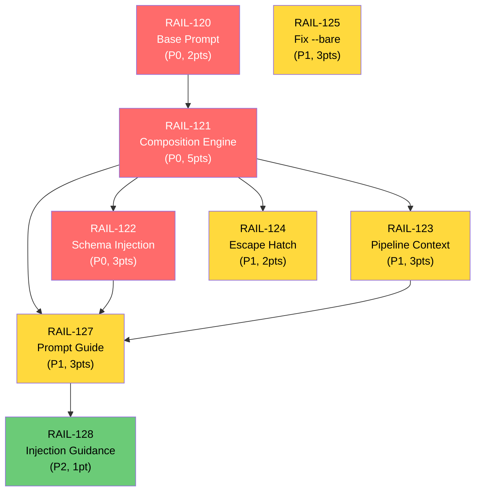

# AgentRails Task Plan — System Prompt Architecture

> **Project:** AgentRails — Deterministic AI Workflow Runtime
> **Created:** 2026-04-04
> **Status:** Sprint 9 Planning
> **Source:** [IMPROVEMENTS.md](./IMPROVEMENTS.md) — System Prompt Architecture & Improvements
> **Depends On:** All Sprints 1-8 complete (TASKPLAN.md)
> **Last Updated:** 2026-04-04

---

## Overview

This task plan covers the system prompt architecture improvements identified in `IMPROVEMENTS.md`. The core problem: when a workflow author sets any `system_prompt` on an agent step, the `--system-prompt` CLI flag **fully replaces** the agent's built-in operational instructions (tool usage, safety guardrails, output conventions). The author has no indication this is happening.

The solution is a layered prompt composition model where AgentRails owns a base prompt (Layer 1), composes it with workflow defaults (Layer 2) and step overrides (Layer 3), auto-injects output schema and pipeline context (Layer 4), and passes the full composed result via `--system-prompt`.

### Task Summary

| Task | Title | Priority | Points | Depends On | Status |
|------|-------|----------|--------|------------|--------|
| `RAIL-120` | AgentRails Base Prompt (Layer 1) | P0 | 2 | — | Pending |
| `RAIL-121` | Prompt Composition Engine | P0 | 5 | `RAIL-120` | Pending |
| `RAIL-122` | Auto-Inject Output Schema (Layer 4) | P0 | 3 | `RAIL-121` | Pending |
| `RAIL-123` | Auto-Inject Pipeline Context (Layer 4) | P1 | 3 | `RAIL-121` | Pending |
| `RAIL-124` | `raw_system_prompt` Escape Hatch | P1 | 2 | `RAIL-121` | Pending |
| `RAIL-125` | Fix Subagent `--bare` Exemption | P1 | 3 | — | Pending |
| `RAIL-127` | Prompt Craft Documentation | P1 | 3 | `RAIL-121`, `RAIL-122`, `RAIL-123` | Pending |
| `RAIL-128` | Prompt Injection Guidance | P2 | 1 | `RAIL-127` | Pending |
| | **Total** | | **22** | | |

---

## Priority Legend

| Priority | Label | Meaning |
|----------|-------|---------|
| P0 | **Must Have** | Blocks correctness — agent steps silently lose operational instructions without this |
| P1 | **Should Have** | Expected for a complete solution, but not a hard blocker |
| P2 | **Could Have** | Enhances the solution, can slip to next cycle |

## Story Point Scale

| Points | Complexity |
|--------|------------|
| 1 | Trivial — config, renaming, small helpers |
| 2 | Small — single-file, well-understood change |
| 3 | Medium — multi-file, some design decisions |
| 5 | Large — cross-cutting, needs integration testing |
| 8 | Very Large — architectural, multiple subsystems |

---

## Epic 10: System Prompt Architecture

> **Goal:** Replace the current pass-through system prompt model with a layered composition architecture that ensures agent steps always receive operational instructions, output schema awareness, and pipeline context — while giving workflow authors full control.

### 10.1 — AgentRails Base Prompt (Layer 1)

| Field | Value |
|-------|-------|
| **ID** | `RAIL-120` |
| **Priority** | P0 |
| **Points** | 2 |
| **Depends On** | — |
| **Assignable** | Yes |

**Description:**
Create the AgentRails base prompt — the framework-provided Layer 1 that is prepended to every agent step's system prompt by default. This prompt provides operational instructions for headless pipeline agents: tool usage conventions, code editing discipline, scope/safety guardrails, and output format instructions.

**Design Principles:**
- **Agnostic** — no references to specific AI providers, CLI tools, or model names. AgentRails may support multiple agent backends.
- **Concise** — under 600 words. Every word competes with task context in the context window.
- **Headless-first** — no interactive-mode assumptions (no approval flows, no emoji policy, no memory systems).
- **Operational** — focuses on how to work, not what to think about.

**Acceptance Criteria:**
- [ ] File `agentrails/prompts/base.md` created with the base prompt content from IMPROVEMENTS.md Section 1.3
- [ ] Prompt is under 600 words
- [ ] Prompt contains zero references to any specific AI provider, CLI tool, or model name
- [ ] Prompt covers these sections: Tools and file operations, Working with code, Scope and safety, Output discipline, Work style
- [ ] Prompt is loadable at runtime: `importlib.resources` or `pathlib` relative to package root
- [ ] Unit test verifies the file exists, is loadable, and is under 600 words
- [ ] Unit test verifies no provider-specific terms appear (regex scan for known terms)

**Implementation Notes:**
- Store in `agentrails/prompts/base.md` as a plain markdown file (not a Python string)
- Include `agentrails/prompts/__init__.py` with a `load_base_prompt() -> str` helper function
- The prompt content is defined in IMPROVEMENTS.md Section 1.3 — use it as-is
- Ensure `pyproject.toml` includes `agentrails/prompts/` in the package data (hatchling should pick up `.md` files automatically, but verify)

---

### 10.2 — Prompt Composition Engine

| Field | Value |
|-------|-------|
| **ID** | `RAIL-121` |
| **Priority** | P0 |
| **Points** | 5 |
| **Depends On** | `RAIL-120` |
| **Assignable** | Yes |

**Description:**
Implement the four-layer prompt composition logic that assembles the final system prompt at runtime. This is the central architectural change — it replaces the current pass-through behavior where `agent_step.py` forwards the author's system prompt directly to `session_manager.py`.

**Layer Model:**
```
Layer 1: AgentRails Base Prompt        ← agentrails/prompts/base.md (always, unless raw_system_prompt)
Layer 2: Workflow Defaults             ← defaults.system_prompt from YAML
Layer 3: Step Override                 ← step-level system_prompt / system_prompt_file
Layer 4: Auto-Injected Context         ← output schema + pipeline context (RAIL-122, RAIL-123)
```

Final composed prompt: `Layer 1 + Layer 2 + Layer 3 + Layer 4`, concatenated with section separators (`\n\n---\n\n`).

**Acceptance Criteria:**
- [ ] New function `compose_system_prompt()` in `agentrails/steps/agent_step.py` (or a new `agentrails/prompt_composer.py` module) that:
  - Accepts: `base_prompt`, `workflow_default_prompt`, `step_prompt`, `auto_context` (all optional strings)
  - Returns: composed prompt string with section separators
  - Skips empty/None layers (no empty separators)
- [ ] `AgentStep.execute()` calls `compose_system_prompt()` instead of passing `system_prompt` directly
- [ ] When no system prompt is specified at any layer, the agent still receives Layer 1 (base prompt)
- [ ] When `raw_system_prompt: true` is set (RAIL-124), only Layer 3 is used — all other layers are skipped
- [ ] Workflow `defaults.system_prompt` is available to `AgentStep` via `ExecutionContext` or direct parameter
- [ ] `ExecutionContext` (in `steps/base.py`) extended with:
  - `workflow_default_system_prompt: str | None` — the `defaults.system_prompt` value from the workflow
- [ ] `engine.py` populates the new `ExecutionContext` field from the parsed `Workflow.defaults`
- [ ] The composed prompt is passed to `session_manager.start_session()` as the `system_prompt` parameter
- [ ] Existing tests continue to pass (backward compatible — steps with no system prompt now get Layer 1 instead of nothing)

**Test Cases:**
- [ ] Test: no system prompt at any level -> composed = base prompt only
- [ ] Test: workflow default only -> composed = base + default
- [ ] Test: step override only -> composed = base + step
- [ ] Test: all three layers -> composed = base + default + step (in order, with separators)
- [ ] Test: empty string system prompt is treated as absent (not an empty layer)
- [ ] Test: `raw_system_prompt: true` -> composed = step prompt only (no base, no default)
- [ ] Test: system_prompt_file is loaded and used as Layer 3

**Implementation Notes:**
- The separator between layers should be `\n\n---\n\n` — visually distinct but not wasteful
- Consider adding a `# Workflow context` header before Layer 2 and a `# Task instructions` header before Layer 3 for agent clarity
- The `system_prompt_file` loading (from RAIL-081) should happen before composition — it feeds into Layer 3
- Keep `compose_system_prompt()` as a pure function (no side effects, no I/O) for testability
- The `session_manager.py` interface does not change — it still receives a single `system_prompt` string

---

### 10.3 — Auto-Inject Output Schema (Layer 4)

| Field | Value |
|-------|-------|
| **ID** | `RAIL-122` |
| **Priority** | P0 |
| **Points** | 3 |
| **Depends On** | `RAIL-121` |
| **Assignable** | Yes |

**Description:**
When a step specifies `output_format: json` (or `toml`) with an `output_schema`, the schema is currently only used for post-hoc validation in `OutputParser`. The agent has no awareness of the expected output shape unless the workflow author manually duplicates it in the prompt. Auto-inject the schema into the system prompt as part of Layer 4.

**Acceptance Criteria:**
- [ ] When `output_format` is `json` or `toml` AND `output_schema` is defined, a schema instruction block is appended to the composed system prompt as Layer 4 content
- [ ] The injected block follows this format:
  ```
  # Required output format

  Your response must be valid {FORMAT} conforming to this schema:

  ```{format}
  {schema_json}
  ```

  Produce only the {FORMAT} object. Do not include any text before or after it.
  ```
- [ ] When `output_format` is `json` or `toml` but `output_schema` is NOT defined, inject a simpler instruction:
  ```
  # Required output format

  Your response must be valid {FORMAT}. Produce only the {FORMAT} object.
  Do not include any text before or after it.
  ```
- [ ] When `output_format` is `text` or not specified, no schema block is injected
- [ ] When `raw_system_prompt: true`, no schema block is injected (Layer 4 is skipped)
- [ ] The schema JSON is pretty-printed with 2-space indent for readability
- [ ] Schema injection happens in `AgentStep.execute()` as part of the `compose_system_prompt()` call

**Test Cases:**
- [ ] Test: JSON schema defined -> schema block appears in composed prompt
- [ ] Test: TOML schema defined -> schema block uses "TOML" format name
- [ ] Test: No schema, but output_format=json -> simpler format-only instruction injected
- [ ] Test: output_format=text -> no schema block
- [ ] Test: raw_system_prompt=true with schema -> schema NOT injected
- [ ] Test: schema is valid JSON when pretty-printed

**Implementation Notes:**
- Build the schema block in `AgentStep.execute()` and pass it as the `auto_context` parameter to `compose_system_prompt()`
- When the underlying agent CLI supports `--json-schema`, also pass the schema there for belt-and-suspenders validation. This is a future optimization and not required for this task.
- The schema block should come before pipeline context in the Layer 4 section (output format is more important than pipeline position)

---

### 10.4 — Auto-Inject Pipeline Context (Layer 4)

| Field | Value |
|-------|-------|
| **ID** | `RAIL-123` |
| **Priority** | P1 |
| **Points** | 3 |
| **Depends On** | `RAIL-121` |
| **Assignable** | Yes |

**Description:**
Agents running in a pipeline have no awareness of their position — what step they are, what workflow they belong to, or what has already completed. Auto-inject minimal pipeline context as part of Layer 4 so agents can reason about their scope and responsibilities.

**Acceptance Criteria:**
- [ ] Pipeline context block is appended to the composed system prompt (as part of Layer 4, after any schema block):
  ```
  # Pipeline context

  - Workflow: {workflow_name}
  - Current step: {step_id}
  - Steps completed: {completed_step_ids, comma-separated, or "none"}
  - This step depends on: {depends_on_ids, comma-separated, or "nothing (first step)"}
  ```
- [ ] `ExecutionContext` (in `steps/base.py`) extended with:
  - `workflow_name: str` — the workflow `name` field from YAML
  - `completed_steps: set[str]` — set of step IDs that have completed successfully
- [ ] `engine.py` populates these new fields when creating the `ExecutionContext` for each step
- [ ] When `raw_system_prompt: true`, pipeline context is NOT injected (Layer 4 is skipped)
- [ ] The context block costs ~50 tokens — verify it stays compact

**Test Cases:**
- [ ] Test: first step (no dependencies, no completed steps) -> "Steps completed: none", "depends on: nothing (first step)"
- [ ] Test: step with dependencies and completed predecessors -> correct lists
- [ ] Test: completed_steps is sorted alphabetically for deterministic output
- [ ] Test: raw_system_prompt=true -> no pipeline context injected
- [ ] Test: pipeline context appears after schema block in the composed prompt

**Implementation Notes:**
- The `depends_on` list is available from `step.depends_on` (already on `BaseStep`)
- The `completed_steps` set is maintained by the engine's execution loop — it needs to be passed through `ExecutionContext`
- Do NOT inject: full state dumps (can be enormous), downstream step details (unnecessary), timing/retry info (irrelevant unless the step's logic needs it)
- The pipeline context block is built in `AgentStep.execute()` and combined with the schema block as `auto_context` for `compose_system_prompt()`

---

### 10.5 — `raw_system_prompt` Escape Hatch

| Field | Value |
|-------|-------|
| **ID** | `RAIL-124` |
| **Priority** | P1 |
| **Points** | 2 |
| **Depends On** | `RAIL-121` |
| **Assignable** | Yes |

**Description:**
Advanced users who need complete control over the system prompt (non-coding agents, specialized integrations, translation agents) should be able to bypass the layered composition model entirely.

```yaml
- id: translate
  type: agent
  raw_system_prompt: true
  system_prompt: |
    You are a translation agent. Translate the input text to French.
    Respond with only the translated text, nothing else.
```

When `raw_system_prompt: true`, only the step's `system_prompt` (Layer 3) is used. Layers 1, 2, and 4 are all skipped.

**Acceptance Criteria:**
- [ ] `BaseStep` (in `steps/base.py`) gains a `raw_system_prompt: bool = False` field
- [ ] `AgentStep` respects `raw_system_prompt` — when `True`, `compose_system_prompt()` returns only the step's system prompt (no base, no defaults, no auto-injected context)
- [ ] `dsl_parser.py` parses `raw_system_prompt` from YAML step definitions (boolean, defaults to `false`)
- [ ] `raw_system_prompt` is included in `serialize()` / `deserialize()` for checkpointing
- [ ] If `raw_system_prompt: true` and no `system_prompt` is set, the agent receives no system prompt at all (equivalent to current behavior)
- [ ] Workflow `defaults` can set `raw_system_prompt: true` to apply to all steps (overridable per-step)

**Test Cases:**
- [ ] Test: `raw_system_prompt: true` with system_prompt -> only step prompt used
- [ ] Test: `raw_system_prompt: true` without system_prompt -> no system prompt passed
- [ ] Test: `raw_system_prompt: true` ignores workflow default system prompt
- [ ] Test: `raw_system_prompt: true` ignores auto-injected schema and pipeline context
- [ ] Test: `raw_system_prompt: false` (default) -> normal layered composition
- [ ] Test: serialize/deserialize roundtrip preserves `raw_system_prompt`
- [ ] Test: parser accepts `raw_system_prompt` in YAML

**Implementation Notes:**
- This is a simple boolean gate in the composition logic — check it early in `compose_system_prompt()` or in `AgentStep.execute()`
- Document clearly that `raw_system_prompt: true` means the agent loses all framework-provided instructions

---

## Epic 11: Subagent Determinism

> **Goal:** Fix the `--bare` flag exemption for subagent steps to restore the determinism guarantee, while preserving subagents' specialized built-in prompts.

**Key decision:** For subagents, use `--append-system-prompt` instead of `--system-prompt`. This:
- Preserves the subagent's specialized built-in instructions (e.g., "read-only GitLab specialist")
- Adds AgentRails pipeline context (output format, step ID) without overwriting the persona
- Avoids loading project-level config files (CLAUDE.md, hooks, MCP) that break determinism

For regular agent steps, continue using `--system-prompt` with the full composed prompt (AgentRails Layer 1 replaces the generic built-in prompt).

### 11.1 — Fix Subagent `--bare` Exemption

| Field | Value |
|-------|-------|
| **ID** | `RAIL-125` |
| **Priority** | P1 |
| **Points** | 3 |
| **Depends On** | — |
| **Assignable** | Yes |

**Description:**
In `session_manager.py:253-255`, the `--bare` flag is skipped when a `subagent` is specified. This means subagent sessions load project-level configuration files (CLAUDE.md, hooks, MCP servers, plugins) from the filesystem, breaking the determinism guarantee. Two runs of the same workflow can produce different results if the project's configuration changes between runs.

**The Problem (current code):**
```python
if not subagent:
    cmd.append("--bare")
```

**The Fix:**
```python
# Always use --bare for determinism
cmd.append("--bare")
```

**Acceptance Criteria:**
- [ ] `session_manager.py` always appends `--bare` to the CLI command, regardless of whether `subagent` is set
- [ ] The conditional `if not subagent:` around `--bare` is removed
- [ ] When `subagent` is set: use `--append-system-prompt` instead of `--system-prompt` (preserves subagent's specialized built-in prompt)
- [ ] When `subagent` is NOT set: use `--system-prompt` with the full composed prompt (Layers 1-4)
- [ ] Existing subagent test fixtures (`tests/fixtures/subagent.yaml`) continue to pass
- [ ] New test: verify `--bare` is present in the command for both regular and subagent sessions
- [ ] New test: verify `--agent <name>` flag is still passed when `subagent` is set
- [ ] New test: verify `--append-system-prompt` (not `--system-prompt`) is used when `subagent` is set
- [ ] Document the change in CHANGELOG or commit message

**Implementation Notes:**
- This is a one-line fix in `session_manager.py`, but it has semantic implications
- Subagents that previously relied on project-level MCP servers or settings will break — this is intentional and necessary for determinism
- The `--bare` flag strips: CLAUDE.md, hooks, auto-memory, MCP servers, plugins
- **Subagents keep their specialized built-in prompts** — `--append-system-prompt` adds AgentRails context without overwriting the subagent's persona (e.g., "read-only GitLab specialist")
- Regular agent steps get the full composed prompt via `--system-prompt` (replacing the generic built-in prompt with AgentRails Layer 1 + workflow context)

**Revision (April 2026):** The original plan (`--bare --agent <name>`) was found to break MCP access for subagents using OAuth-based HTTP MCP servers (Slack, Jira, GitLab). The actual implementation uses inline `@'name (agent)'` syntax prepended to the prompt, without `--bare`. See `IMPROVEMENTS.md` Section 4 for details.

---

## Epic 12: Documentation

> **Goal:** Provide workflow authors with clear guidance on how system prompts compose, best practices for prompt writing, and security awareness for dynamic prompt content.

### 12.1 — Prompt Craft Documentation

| Field | Value |
|-------|-------|
| **ID** | `RAIL-127` |
| **Priority** | P1 |
| **Points** | 3 |
| **Depends On** | `RAIL-121`, `RAIL-122`, `RAIL-123` |
| **Assignable** | Yes |

**Description:**
Write a dedicated documentation page covering prompt composition for AgentRails workflows. This prevents workflow authors from unknowingly sabotaging their agent steps with poorly structured or redundant system prompts.

**Acceptance Criteria:**
- [ ] File `docs/prompt-guide.md` created with the following sections:
  1. **How system prompts compose** — the four-layer model with a visual diagram
  2. **When to use each layer** — table with use cases and examples (from IMPROVEMENTS.md Section 5.2)
  3. **Prompt writing best practices** — do's and don'ts (from IMPROVEMENTS.md Section 5.3)
  4. **Example: well-structured workflow** — complete YAML example showing all layers in action (from IMPROVEMENTS.md Section 5.4)
  5. **The `raw_system_prompt` escape hatch** — when and how to use it
  6. **What gets auto-injected** — output schema and pipeline context, with examples of what the agent actually sees
- [ ] All content is agnostic — no references to specific AI providers or CLI tools
- [ ] Examples use realistic workflow scenarios (not toy examples)
- [ ] Cross-referenced from `docs/WORKFLOW_AUTHORING.md` (add a "System Prompts" link)
- [ ] Cross-referenced from `CLAUDE.md` (add to the "YAML DSL Reference" section)
- [ ] Cross-referenced from `README.md` (add to documentation links)

**Implementation Notes:**
- The content for this document is largely written in IMPROVEMENTS.md Sections 1.2, 1.3, 1.4, and 5.1-5.4 — consolidate and restructure for a documentation audience
- Include a "What the agent actually sees" section that shows a complete composed prompt with all four layers, so authors can understand the full picture
- Keep it under 500 lines — this is a reference guide, not a tutorial

---

### 12.2 — Prompt Injection Guidance

| Field | Value |
|-------|-------|
| **ID** | `RAIL-128` |
| **Priority** | P2 |
| **Points** | 1 |
| **Depends On** | `RAIL-127` |
| **Assignable** | Yes |

**Description:**
Add a security section to the prompt guide covering prompt injection risks when step prompts include dynamic state content via `{{state.xxx}}` templates.

**Acceptance Criteria:**
- [ ] Section added to `docs/prompt-guide.md` covering:
  - What prompt injection is in the context of pipelines
  - How `{{state.xxx}}` interpolation creates injection surface
  - Specific scenarios: upstream step processes untrusted input, API responses, user-submitted text
  - Mitigations: output_schema validation on upstream steps, passing data via files instead of inline, sanitization
- [ ] Content adapted from IMPROVEMENTS.md Section 5.5
- [ ] At least one concrete example showing an injection scenario and its mitigation

**Implementation Notes:**
- This is a documentation-only task — no code changes
- Keep it concise (under 100 lines) — this is awareness, not a comprehensive security guide

---

## Sprint Planning

### Sprint 9 — System Prompt Architecture (22 points)

**Goal:** Implement the full layered prompt composition system, auto-injection, and fix the subagent determinism issue.

| Week | Tasks | Points |
|------|-------|--------|
| Week 1 | `RAIL-120` Base Prompt, `RAIL-125` Fix --bare | 5 |
| Week 2 | `RAIL-121` Composition Engine | 5 |
| Week 3 | `RAIL-122` Schema Injection, `RAIL-123` Pipeline Context, `RAIL-124` Escape Hatch | 8 |
| Week 4 | `RAIL-127` Prompt Guide, `RAIL-128` Injection Guidance | 4 |
| **Total** | | **22** |

**Execution Order (respects dependencies):**
1. `RAIL-120` (base prompt) + `RAIL-125` (--bare fix) — independent, can be done in parallel
2. `RAIL-121` (composition engine) — depends on RAIL-120
3. `RAIL-122` (schema injection) + `RAIL-123` (pipeline context) + `RAIL-124` (escape hatch) — all depend on RAIL-121, independent of each other
4. `RAIL-127` (prompt guide) — depends on RAIL-121, RAIL-122, RAIL-123 (document what's built)
5. `RAIL-128` (injection guidance) — depends on RAIL-127

---

## Dependency Graph



**Legend:** Red = P0, Yellow = P1, Green = P2

---

## Files Changed

| File | Change | Tasks |
|------|--------|-------|
| `agentrails/prompts/__init__.py` | **New** — `load_base_prompt()` helper | `RAIL-120` |
| `agentrails/prompts/base.md` | **New** — AgentRails base prompt (Layer 1) | `RAIL-120` |
| `agentrails/steps/agent_step.py` | Compose layers; auto-inject schema and pipeline context | `RAIL-121`, `RAIL-122`, `RAIL-123` |
| `agentrails/steps/base.py` | Add `raw_system_prompt` field; extend `ExecutionContext` | `RAIL-121`, `RAIL-123`, `RAIL-124` |
| `agentrails/engine.py` | Pass pipeline context and workflow defaults through `ExecutionContext` | `RAIL-121`, `RAIL-123` |
| `agentrails/dsl_parser.py` | Parse `raw_system_prompt` | `RAIL-124` |
| `agentrails/session_manager.py` | Always use `--bare` | `RAIL-125` |
| `docs/prompt-guide.md` | **New** — Workflow author prompt craft documentation | `RAIL-127`, `RAIL-128` |
| `docs/WORKFLOW_AUTHORING.md` | Add cross-reference to prompt guide | `RAIL-127` |
| `CLAUDE.md` | Add prompt composition to YAML DSL Reference | `RAIL-127` |
| `tests/test_prompt_composition.py` | **New** — Composition engine tests | `RAIL-121` |
| `tests/test_steps/test_agent_step.py` | Schema injection, pipeline context, raw_system_prompt tests | `RAIL-122`, `RAIL-123`, `RAIL-124` |
| `tests/test_prompts.py` | **New** — Base prompt loading and validation tests | `RAIL-120` |
| `tests/test_session_manager.py` | Verify `--bare` always present | `RAIL-125` |

---

## CLAUDE.md Updates Required

After Sprint 9 is complete, update `CLAUDE.md` with:

1. **YAML DSL Reference — AgentStep:** Add `raw_system_prompt` field documentation
2. **Key Abstractions — SessionManager:** Document that `--bare` is always used
3. **Key Abstractions — New section:** "Prompt Composition" explaining the four-layer model
4. **Package Layout:** Add `agentrails/prompts/` directory and files
5. **See Also:** Add link to `docs/prompt-guide.md`
